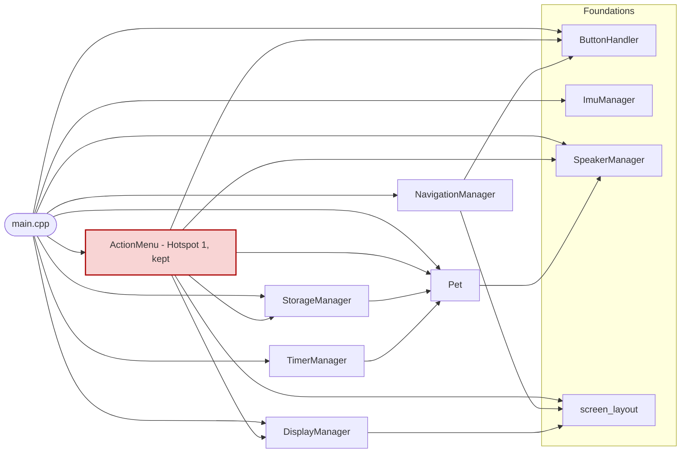

# Virtual Pet — Developer Roadmap

> **Audience:** Students of varying skill levels.
> **Hardware:** M5StickC Plus 2 (ESP32-PICO-V3-02, MPU6886, LCD 135×240, Buzzer, Microphone)
> **Pedagogical rules:** No clever syntax. Full descriptive names. Every function gets a comment.

---

## Part 1 — Audit: Completed vs. Missing Items

Items are mapped directly against `COURSE_CHECKLIST.md`.

### Phase 1: Foundations & UI

| Checklist Item | Status | Where It Lives |
|---|---|---|
| Hardware Initialization (M5.begin, LCD, Serial) | ✅ Done | `src/main.cpp` → `setup()`, `lib/Display/display_manager.cpp` → `init()` |
| Asset Pipeline (images/gifs → C++ arrays) | ✅ Done | `tools/piskel_converter/main.cpp` — C++ host-side converter (ARGB8888 → RGB565, byte-swapped for LCD byte order). `SPRITE_GUIDE.md` — student walkthrough. `assets/sprites/raw/` — raw Piskel .c exports. `lib/Display/sprites/` — converted .h files. `src/main.cpp` → `#define SPRITE_TEST` — bypass flag for isolated sprite rendering tests. Note: values are pre-swapped (0x1FF8 transparent key) to match the M5StickC Plus 2 LCD's big-endian byte-order expectation over SPI |
| Basic Sprite Rendering (draw pet to screen) | ✅ Done | `lib/Display/display_manager.cpp` → `drawPetSprite()` renders bitmap sprites via `M5.Lcd.pushImage()` with transparent key `0x1FF8`. Three sizes used: 64×64 on Main, 48×48 on Interact, 32×32 on Stats. Sprite assets in `lib/Display/sprites/`. The placeholder circle face (`drawPetFace()`) was removed |
| Screen Real Estate Management (stats zone vs. pet zone) | ✅ Done | `lib/Display/screen_layout.h` → `ScreenZone` / `StatBarZone` / `ScreenState` / `RelevantStat`. Zone constants in `display_manager.h`. Three-screen framework (Main, Stats, Interact) in `display_manager.cpp` → `renderMainScreen()` / `renderStatsScreen()` / `renderInteractScreen()`. Navigation in `lib/Navigation/navigation_manager.h/.cpp` |

### Phase 2: Core Logic & State Machine

| Checklist Item | Status | Where It Lives |
|---|---|---|
| State Machine Architecture (IDLE, EATING, SLEEPING, EVOLVING) | ✅ Done | `lib/Pet/pet.h` → `PetState` enum. `lib/Pet/pet.cpp` → `updateState()` / `setState()` / `getState()` |
| State Machine — Full Action Coverage (PLAYING, SICK, HEALING, BATHING) | ✅ Done | `lib/Pet/pet.h` → expanded `PetState` enum. `lib/Pet/pet.cpp` → new cases in `updateState()`, `setState()` wired into `play()`, `bathe()`, `heal()` |
| Hunger Logic (timer-based decrement) | ✅ Done | `lib/Timer/time_manager.cpp` → `applyHungerIncrease()` |
| Happiness Logic (timer-based decrement) | ✅ Done | `lib/Timer/time_manager.cpp` → `applyHappinessDecay()` |
| Energy/Sleep Logic (recovery vs. depletion) | ✅ Done | Auto-drain in `lib/Timer/time_manager.cpp` → `applyEnergyDrain()`. Manual recovery via `pet.cpp` → `sleep()` |
| Death/Reset Condition (handle 0 stats) | ✅ Done | `lib/Pet/pet.h` → `isDead()` / `reset()`. Death screen routed through `display_manager.cpp` → `renderDisplay()` |
| Cleanliness Decay Logic (timer-based decrement) | ✅ Done | `lib/Timer/time_manager.cpp` → `applyCleanlinessDecay()`. Drops by 1 every 10 seconds |
| Sickness Accumulation Logic (rises when cleanliness is low) | ✅ Done | `lib/Timer/time_manager.cpp` → `applySicknessAccumulation()`. Rises by 1 every 12 seconds when `cleanliness` is below 30 |
| Sadness Logic (rises when happiness is low) | ⏸ Deferred | `sad` stat, getter, setter, default constant already exist in `Pet`. Needs: a `TimerManager` rule to raise `sad` when `happy` falls below a threshold, and a sad sprite to display it. Revisit after the asset pipeline (Task 12) is complete |
| Cleanliness / Sickness Display | ✅ Done | Both bars shown in `display_manager.cpp` → `showPetStatus()`. Layout tightened to fit all five stats |

### Phase 3: Interaction & Menu System

| Checklist Item | Status | Where It Lives |
|---|---|---|
| Navigation Logic (B & C cycle, A confirms) | ✅ Done | `lib/Button/button_handler.cpp`, `lib/Actions/action_menu.cpp`, `src/main.cpp:33–49` |
| Menu UI (visual indicators for selected actions) | ✅ Done | `display_manager.cpp:96–108` → `drawMenuIndicator()` |
| Motion Play (MPU6886 accelerometer for Play mode) | ✅ Done | `lib/Imu/imu_manager.h/.cpp` → `ImuManager`. `wasShaken()` called in `src/main.cpp` → triggers `myPet.play()` |
| Sound Feedback (buzzer melodies) | ✅ Done | `lib/Speaker/speaker_manager.h/.cpp` — melodies for all 5 actions, death, reset, hunger alert, sickness alert |
| Microphone Input (Detect & React) | 🔁 Moved to Bonus | Moved to Appendix B during the curriculum realignment (see `CURRICULUM_REALIGNMENT.md`). Out of scope for the learning lab — Level 6 heap allocation is too dense for cold students and the feature is not promised in the course outline. Task 16 detail section below preserved as design reference only |

### Phase 4: Environmental & Advanced Features

| Checklist Item | Status | Where It Lives |
|---|---|---|
| MPU6886 "Shake to Wake" (low-power wake) | 🚫 Removed | Hardware investigation confirmed the MPU6886 INT pin is not routed to an ESP32 GPIO on the M5StickCPlus2 — interrupt-driven wake is not possible on this board |
| RTC (Real Time Clock for overnight logic) | 🔁 Moved to Bonus | Right-sized out of the critical path during the Task 14b audit. Without overnight-decay logic, displaying HH:MM is a stand-alone widget that does not integrate with any other module — not a teaching outcome worth the new-concept slug. See Appendix B — Bonus Feature 1 for the full design |
| NVS Persistence via `Preferences` (save pet on power-off) | ✅ Done | `lib/Storage/storage_manager.h/.cpp` — saves/loads all pet stats via Arduino `Preferences` (NVS). Wired into `setup()` (load) and Save action (write) in `src/main.cpp`. Note: this was originally labelled "EEPROM" but the ESP32 has no real EEPROM hardware — NVS is the correct native mechanism. |
| Evolution Logic (growth stages based on care/time) | ❌ Missing | No growth stage tracking in `Pet` class |

### Phase 5: Connectivity & Polish

| Checklist Item | Status | Where It Lives |
|---|---|---|
| Wireless Access Point Primitive | 🔁 Moved to Bonus | Moved to Appendix B during the curriculum realignment (see `CURRICULUM_REALIGNMENT.md`). Out of scope for the learning lab — networking becomes an optional extension path in Sessions 7–8 of the lab, not a core task. Task 17 detail section below preserved as design reference only |
| Remote Dashboard (Web/App stat checking) | 🔁 Moved to Bonus | Right-sized out of the critical path during the Task 14b audit. The web server pattern adds another module of new concepts (HTTP routes, named callbacks, `String` HTML building) on top of Task 17 — better as a follow-on bonus that students opt into. See Appendix B — Bonus Feature 2 |
| Final UI Polish (comments, descriptive names) | ⚠️ Partial | Existing code is reasonably documented. Magic pixel constants have been replaced with named constants. Bitmap sprites are done as of Task 13. Sprite animation (Task 13a) is deferred — picked back up after Tasks 15–18. |
| SpeakerManager refactor — playNote() helper | ⏸ Deferred | Every sound method repeats the same tone/delay/stop pattern. A `playNote(frequency, duration)` helper could eliminate the repetition. Intentionally left verbose for now so students can read each melody top to bottom without following abstractions. Revisit during the final polish pass. |

---

## Part 2 — Complexity Queue

> **Active migration:** `CURRICULUM_REALIGNMENT.md` is the source of truth for current work.
> Execution order for the remaining in-repo work:
> **14c → 14d → 13a → 20 → 21 → 22 → (move to `virtual-pet-learning-lab`)**.
> (Tasks 19, 19b, 14c, and 14d are done — next up is 13a.)
> Tasks 16, 17, 18, 9a are out of the active queue and live in Appendix B.

Tasks ordered from **easiest** to **hardest** so a student always has a clear next step that builds on what they already know.

```
LEVEL 1 — COPY THE PATTERN (no new concepts)
  1. Happiness auto-decay timer        ✅ Done
  2. Energy auto-drain timer           ✅ Done
  3. Death / Reset condition           ✅ Done
 3a. Cleanliness decay timer           ✅ Done
 3b. Sickness accumulation timer       ✅ Done

LEVEL 2 — SMALL NEW CONCEPT
  4. State Machine Architecture        ✅ Done
 4b. Expand State Machine              ✅ Done
  5. Screen Real Estate constants      ✅ Done

LEVEL 3 — NEW HARDWARE API (library already in project)
  6. MPU6886 Motion Play               ✅ Done
  7. MPU6886 Shake to Wake             🚫 Removed — INT pin not routed on M5StickCPlus2
  8. Buzzer Sound Feedback             ✅ Done

LEVEL 4 — DATA + PLANNING
  9. State Machine Cleanup             ✅ Done (STATE_DEAD + alert timers moved from main into updateState)
  9a. Evolution Logic                  (deferred — age counter + growth stages, requires task 9 refactor)
  9b. Sadness Logic                    (deferred — sad rises when happy is low, needs sad sprite from task 12)
 10. NVS persistence via `Preferences`  ✅ Done (note: ESP32 has no real EEPROM — NVS is the native mechanism)

LEVEL 5 — ASSET PIPELINE
 11. Screen Real Estate layout zones   ✅ Done
11a. Multi-screen framework            ✅ Done (ScreenState enum, NavigationManager, three render methods in DisplayManager, contextual stat bar on Interact screen)
11b. Stats detail screen               ✅ Done (included in 11a — SCREEN_STATS reuses the original zone layout exactly)
11c. Pet interaction screens           ✅ Done (included in 11a — SCREEN_INTERACT shows pet face + contextual stat bar + action menu)
 12. Asset Pipeline (image → C array)  ✅ Done (C++ piskel_converter tool, SPRITE_GUIDE.md, SPRITE_TEST flag in main.cpp, byte-swap fix for M5StickC Plus 2 SPI byte order)
 13. Basic Sprite Rendering            ✅ Done (drawPetSprite via pushImage; three sprite sizes; placeholder circle face removed. Also fixed a converter bug: Piskel exports ABGR8888, not ARGB8888 — the channel extraction had red and blue swapped)
13a. Sprite Animation                  ⏸ Deferred — return after Level 6/7 features (Tasks 15–18). Multi-frame cycling using existing FRAME_COUNT dimension, millis() timer, optional M5Canvas double-buffer for flicker. Will run as the last Level 5 task before Task 19's pre-template simplification.
 14. Initial Simplification Pass       (umbrella — split into 14a code audit and 14b roadmap audit. Gate before Level 6 — streamline existing code AND right-size future tasks before any new features land.)
14a. Code Simplification Audit         ✅ Done (removed dead ActionMenu legacy methods, dead printText(String) overload, STATE_EVOLVING placeholder; fixed Pet::reset() to use DEFAULT_* constants and corrected the cleanliness=60 drift; inlined ActionMenu::executePetAction; collapsed clearScreen overload to default-param. Output: DEV_ROADMAP.md Appendix A — module coupling map for Task 19. Branch: refactor/14a-code-simplification.)
14b. Roadmap Simplification Audit      ✅ Done (right-sized Tasks 15–18 toward minimum teachable foundations. Task 15 RTC moved to Bonus Feature 1; Task 16 narrowed from "Voice Memos" to "Microphone Input (Detect & React)" with happiness +5 and a buzzer chirp; Task 17 narrowed from "Wireless Communication (BLE/WiFi)" to "Wireless Access Point Primitive"; Task 18 Remote Dashboard moved to Bonus Feature 2. Expanded Task 14c into a full section. Added Task 14d (Sprite Display Simplification) to lock in single 80×80 sprite size before animation. Added Appendix B with six bonus features (RTC, Web Dashboard, Pet-to-Pet ESP-NOW, Live-Refreshing Dashboard, Phone-Controlled Actions, Voice Memos). Branch: refactor/14b-roadmap-simplification.)
14c. Gameplay Balance Tuning           ✅ Done (see Task 14c section. Rebalanced the five decay rates — fatal stats now ~10–11 min — plus a 2000 ms shake cooldown and play() cost 20→5. Added an in-file `#define FAST_TEST` toggle keeping a quick-testing value set alongside the shipped set. Branch: task/14c-balance-tuning.)
14d. Sprite Display Simplification     ✅ Done (see Task 14d section. Single 80×80 sprite on every screen; sprite removed from the Stats screen (now a pure data view); Interact face + mood aligned to the Main screen and the bottom bar moved to a shared y=220 so nothing jumps when switching screens; removed the post-action feedback text + delay(1000) in confirmAction(). Deleted the 48×48/64×64/newpiskel2 assets. Branch: task/14d-sprite-simplification.)

⚠️  INITIAL SIMPLIFICATION PASS REQUIRED BEFORE ANY NEW FEATURES
     The codebase has accumulated empty stub modules, unused public methods,
     and at least one dead function overload over the course of Levels 1–5.
     Before starting any Level 6 feature work, walk every module with the
     following questions in mind:
       — Is this file / method / overload actually used anywhere?
       — Are there overloaded functions whose signatures never match a caller?
       — Are any member variables, enum values, or struct fields dead?
       — Can any block of logic be re-written in fewer, clearer steps WITHOUT
         violating the pedagogical rules in CLAUDE.md?
     This is a smaller, narrower pass than Task 19. The goal here is only to
     remove junk and tighten what already exists — NOT to rewrite for teaching.
     New features (RTC, voice memos, networking) wait until this pass is done.

LEVEL 6 — COMPLEX HARDWARE
 15. RTC overnight logic               🔁 Moved to Bonus (see Appendix B — Bonus Feature 1)
 16. Microphone Input (Detect & React) 🔁 Moved to Bonus (curriculum realignment — see CURRICULUM_REALIGNMENT.md; design notes preserved in Task 16 section below)

LEVEL 7 — NETWORKING
 17. Wireless Access Point Primitive   🔁 Moved to Bonus (curriculum realignment — see CURRICULUM_REALIGNMENT.md; design notes preserved in Task 17 section below)
 18. Remote Dashboard                  🔁 Moved to Bonus (see Appendix B — Bonus Feature 2)

PHASE 6 — CURRICULUM REALIGNMENT (active — see CURRICULUM_REALIGNMENT.md)

⚠️  SIMPLIFICATION PASS REQUIRED BEFORE TEMPLATING WORK
     This codebase will be promoted to a separate teaching repo
     (`virtual-pet-learning-lab`). Before that promotion happens, every module
     must be walked through and simplified with the pedagogical rules in
     CLAUDE.md in mind:
       — Can this logic be written in fewer, clearer steps?
       — Are all variable and function names fully descriptive?
       — Does every function have a one-sentence comment explaining what it does AND why?
       — Are there any clever tricks, ternaries, or compact patterns a beginner would not understand?
       — Would a student with no prior C++ experience be able to read this and follow along?
     Simplicity is more important than elegance. If in doubt, expand it.

 19. Pre-Template Simplification        ✅ Done — walked every module against the
     pedagogical rules in CLAUDE.md and verified on device. Highlights:
     replaced `Pet::constrainValues()` with a per-value `constrainValue(int)`
     helper and routed all Pet stat mutation through the setters; converted
     `ScreenState` and `ActionType` from `enum class` to plain enums with
     `SCREEN_*` / `ACTION_*` prefixes; extracted `playPendingAlertSounds()`
     helper in `main.cpp` (Hotspot 3 surface, no flag/poll change yet);
     applied two Category-1 coupling fixes from Appendix A (Hotspot 2:
     DisplayManager takes primitives instead of a `const ActionMenu&`;
     Hotspot 5: NavigationManager takes a `bool backSelected`); added
     what+why comments to under-documented functions in Pet and
     DisplayManager; renamed "player" → "user" throughout all comments.
     No behavioural change.
     Branch: task/19-pre-template-simplification.
 19b. Pet-Owns-Sound Refactor           ✅ Done — moved alert-sound coordination
       out of main.cpp and into Pet. Pet::updateState() and Pet::reset() now take
       a SpeakerManager& parameter and play the pet's own hunger/sickness/death/
       reset sounds directly.
       — NOTE: implemented via a reference PARAMETER, not the stored setSpeaker()
         reference originally specced. A stored reference can't be set after
         construction (Pet is a global built before setup()), which would force a
         pointer; the parameter approach matches the existing
         ActionMenu::confirmAction(Pet&, DisplayManager&, SpeakerManager&,
         StorageManager&) pattern and introduces no pointer/nullptr/-> concepts
         for the beginner audience. So there is no setSpeaker() and no stored member.
       — Deleted the three ready-flags (hungerAlertReady, sicknessAlertReady,
         deathSoundReady), the three checkXAlert() methods, and main.cpp's
         playPendingAlertSounds() helper.
       — KEPT the two lastXAlertTime timestamps as Pet's own rate-limit state.
         The original deletion list conflated them with the poll mechanism; the
         15-second alert nag is unchanged.
       — Also de-cluttered loop(): added Pet::isInDeadState() and extracted
         handleDeathScreen()/updateLivePet()/renderCurrentScreen() so loop() reads
         as a short outline; added a comment block noting setup()/loop() are this
         program's main() on the ESP32 (Arduino style kept — no Game/App class).
       — Verified on device. Branch: task/19b-pet-owns-sound.
 14c. Gameplay Balance Tuning           ✅ Done — ran after Task 19b
     — Rebalanced decay rates (fatal stats ~10–11 min, within 2×), added a
       2000 ms shake cooldown, cut play() cost 20→5, and added an in-file
       #define FAST_TEST toggle (quick-test set kept beside the shipped set).
       Done before Task 20 so mood thresholds map onto tuned stat values.
 14d. Sprite Display Simplification     ✅ Done — ran after Task 14c
     — Single 80×80 sprite on every screen. Removed the sprite from the Stats
       screen. Aligned the Interact face + mood to the Main screen and moved
       the bottom bar to a shared y=220 so nothing jumps when switching screens.
       Removed the post-action feedback text + delay(1000). Locks the sprite
       size before animation work starts.
 13a. Sprite Animation                  — runs after Task 14d
     — 2-frame loop using M5Canvas double-buffering, driven by millis().
       Implements `lib/Display/animation_manager.h/.cpp`. This is the worked
       example students extend in Session 6 of the lab.
 20. Mood Sprite System (new)           — runs after Task 13a
     — Add `MoodSprite` enum (NEUTRAL / HAPPY / UNWELL / HUNGRY).
       Add `Pet::computeMood()` mapping stats → mood with prioritised thresholds.
       Add 4 sprite assets in `lib/Display/sprites/`.
       `DisplayManager::drawPetSprite()` picks the sprite from
       `pet.computeMood()`. Verify on device.
 21. Curriculum Scaffolding Refactor (new) — runs after Task 20
     — Add `#define ENABLE_*` flags so the codebase can be configured for any
       session's day-start state:
         ENABLE_ACTION_MENU     (Session 2)
         ENABLE_IMU_PLAY        (Session 3)
         ENABLE_SOUND           (Session 4)
         ENABLE_PERSISTENCE     (Session 5)
         ENABLE_MULTISCREEN     (Session 6)
         ENABLE_MOOD_SPRITES    (Session 6)
       Every flag combination must compile + flash cleanly. This is the test
       that the scaffolding actually works.
 22. Doc Sweep (new)                    — runs after Task 21
     — With code in final form: rewrite COURSE_CHECKLIST.md against the
       10-session arc; purge IDEAS.md of items now in core scope; update
       CLAUDE.md next-task pointer to "Define Session 1 lesson plan"; audit
       USEFUL_NOTES.md for accuracy.

➡️  AFTER TASK 22 — Work moves to `virtual-pet-learning-lab`
     - This repo is frozen as the curriculum reference.
     - Author writes Session 1's lesson plan in `LESSON_PLANS/SESSION_01.md`
       inside THIS repo (Phase 2 of the realignment), then promotes it.
     - The new repo is initialised from this repo's cleaned-up `main`.
     - See `CURRICULUM_REALIGNMENT.md` Phases 2–4 for the full plan.
```

---

## Part 3 — Hardware Gotchas

These are real pitfalls that will cause mysterious bugs or crashes on the ESP32-PICO-V3-02. Read this section before attempting Levels 5–7.

---

### Gotcha 1 — Audio Buffer Memory on the ESP32-PICO-V3-02

**The problem:** The ESP32-PICO-V3-02 has 520 KB of internal SRAM, but the M5StickC Plus 2 display framebuffer and stack already consume a large chunk. If you allocate a large audio recording buffer on the stack (as a local array inside a function), the device will crash with a stack overflow — often with no error message.

**The rule:** Always allocate audio buffers on the **heap** using `malloc()` (or Arduino's `new`), and always **free** them when done. Never declare a large buffer like `int16_t recordingBuffer[8000]` inside a function.

```cpp
// BAD — this lives on the stack and will crash the device
void recordSound() {
    int16_t recordingBuffer[8000]; // ~16 KB on the stack — CRASH
}

// GOOD — this lives on the heap
void recordSound() {
    // Ask the heap for memory. Check that it succeeded before using it.
    int16_t* recordingBuffer = (int16_t*) malloc(8000 * sizeof(int16_t));

    if (recordingBuffer == nullptr) {
        // malloc returned null — not enough free memory
        Serial.println("ERROR: Not enough memory to record audio.");
        return;
    }

    // ... use recordingBuffer here ...

    // ALWAYS release heap memory when you are done with it
    free(recordingBuffer);
    recordingBuffer = nullptr; // Good habit: nullify the pointer after freeing
}
```

**Tip:** Call `ESP.getFreeHeap()` and print it via Serial before and after your recording function to make sure memory is being released correctly.

---

### Gotcha 2 — Non-Blocking Logic with `millis()` (Never Use `delay()` in the Main Loop)

**The problem:** `delay(1000)` pauses the entire program for 1 second. During that pause, button presses are ignored, the pet's face freezes, and the device feels "dead". This is called **blocking** code.

**The rule:** Use `millis()` to track time without stopping the program. The pattern is always the same three lines:

```cpp
// Declare a variable to remember when the last event happened.
// The word 'static' means it keeps its value between loop() calls.
static unsigned long lastHappinessDecayTime = 0;

// Inside loop() — check if enough time has passed
if (millis() - lastHappinessDecayTime >= 5000) {  // 5000 ms = 5 seconds
    // Do the timed action here
    myPet.setHappy(myPet.getHappy() - 1);

    // Remember when this last happened so the timer resets
    lastHappinessDecayTime = millis();
}
```

**This is the SAME pattern** used in `lib/Timer/time_manager.cpp` for both the hunger and happiness timers. Every timed feature in this project should use this pattern.

**Warning:** Never use `delay()` inside `loop()`, `update()`, or any function called from `loop()`. It is fine to use `delay()` once inside `setup()` for a startup message.

---

### Gotcha 3 — Screen Flicker Prevention with M5Canvas (Double-Buffering)

**The problem:** Calling `M5.Lcd.clear()` followed by multiple draw calls causes visible flickering because the screen is blank for a fraction of a second between clears and redraws. This is already partially managed by the 5-second `STATUS_UPDATE_INTERVAL` in `display_manager.cpp:48–53`, but for fast-moving animations it will not be enough.

**The solution:** Use `M5Canvas` as an off-screen buffer. You draw everything onto the invisible canvas first, then "push" the finished image to the screen in one fast operation. The screen never shows a blank intermediate state.

```cpp
#include "M5StickCPlus2.h"

// Create a canvas the same size as the screen
M5Canvas canvas(&M5.Lcd);

void setup() {
    M5.begin();
    // Tell the canvas how big to be (matches the screen: 135 wide, 240 tall)
    canvas.createSprite(135, 240);
}

void drawFrame() {
    // Step 1: Draw everything onto the INVISIBLE canvas (never shows flicker)
    canvas.fillSprite(TFT_BLACK);         // Clear the canvas with black
    canvas.drawCircle(67, 120, 25, TFT_WHITE); // Draw pet face onto canvas

    // Step 2: Push the finished canvas to the REAL screen all at once
    // Arguments: destination X, destination Y on the real screen
    canvas.pushSprite(0, 0);
}
```

**Memory note:** A full 135×240 canvas at 16-bit colour uses `135 × 240 × 2 = 64,800 bytes` (~63 KB) of heap. This is safe on the ESP32-PICO-V3-02 as long as you are not also holding a large audio buffer at the same time. If you run low on heap, reduce the canvas to cover only the animated region of the screen rather than the full display.

---

## Part 4 — Next Best Foundational Tasks

---

### Task 3a — Cleanliness Decay Timer ✅ Next

**Why this task next?**

`cleanliness` can already be increased by `bathe()`, but it never decreases on its own. The pet can stay perfectly clean forever without any effort, which makes the bathe action pointless. This task adds the missing decay timer using the exact same `millis()` pattern students have already seen three times in Tasks 1–3. No new concepts — just practice.

**Exactly where to add the code:**

Step 1 — Add the decay function declaration to `lib/Timer/time_manager.h`, alongside the existing timer declarations:
```cpp
// Decreases cleanliness over time so the pet gets dirty without bathing
void applyCleanlinessDecay(Pet& pet);
```

Step 2 — Add the implementation to `lib/Timer/time_manager.cpp`:
```cpp
// applyCleanlinessDecay()
// Decreases cleanliness by 1 every 8 seconds. The pet gets dirty over time
// and will need bathing, making the bathe action meaningful.
void TimerManager::applyCleanlinessDecay(Pet& pet) {
    static unsigned long lastCleanlinessDecayTime = 0;
    unsigned long cleanlinessDecayInterval = 8000;

    if (millis() - lastCleanlinessDecayTime >= cleanlinessDecayInterval) {
        pet.setCleanliness(pet.getCleanliness() - 1);
        lastCleanlinessDecayTime = millis();
    }
}
```

Step 3 — Call it inside `TimerManager::update()` in `time_manager.cpp`:
```cpp
applyCleanlinessDecay(pet);
```

**Files touched:** `lib/Timer/time_manager.h` and `lib/Timer/time_manager.cpp`.

---

### Task 3b — Sickness Accumulation Timer

**Why this task next?**

`sick` can only be decreased by `heal()`, but it never increases — the pet can never actually get sick. This task makes sickness a real threat by slowly increasing `sick` when `cleanliness` is low. It uses the same `millis()` timer pattern but introduces a simple conditional: the timer only fires when a condition is met. A natural next step after 3a.

**Exactly where to add the code:**

Step 1 — Add the declaration to `lib/Timer/time_manager.h`:
```cpp
// Increases sickness over time when the pet is dirty
void applySicknessAccumulation(Pet& pet);
```

Step 2 — Add the implementation to `lib/Timer/time_manager.cpp`:
```cpp
// applySicknessAccumulation()
// Increases sick by 1 every 10 seconds when cleanliness is below 30.
// A dirty pet gradually becomes unwell — bathing prevents this.
void TimerManager::applySicknessAccumulation(Pet& pet) {
    static unsigned long lastSicknessAccumulationTime = 0;
    unsigned long sicknessAccumulationInterval = 10000;
    int cleanlinessDangerThreshold = 30;

    if (pet.getCleanliness() < cleanlinessDangerThreshold) {
        if (millis() - lastSicknessAccumulationTime >= sicknessAccumulationInterval) {
            pet.setSick(pet.getSick() + 1);
            lastSicknessAccumulationTime = millis();
        }
    }
}
```

Step 3 — Call it inside `TimerManager::update()`:
```cpp
applySicknessAccumulation(pet);
```

**Files touched:** `lib/Timer/time_manager.h` and `lib/Timer/time_manager.cpp`.

---

### Task 4b — Expand State Machine (PLAYING, SICK, HEALING, BATHING)

**Why this task next?**

Task 4 added the state machine foundation but only wired two actions into it — `feed()` and `sleep()`. The remaining three care actions (`play()`, `bathe()`, `heal()`) still set no state, which means the switch handler can never react to them. This task closes that gap. The student already knows the enum and switch pattern from Task 4 — this is purely practice: add four more states, four more cases, and four more `setState()` calls.

**Exactly where to add the code:**

Step 1 — Add the four new states to the `PetState` enum in `lib/Pet/pet.h`:
```cpp
enum PetState {
    STATE_IDLE,      // Default — pet is awake but doing nothing
    STATE_EATING,    // Triggered by feed() — pet is eating
    STATE_SLEEPING,  // Triggered by sleep() — pet is resting
    STATE_PLAYING,   // Triggered by play() — pet is exercising
    STATE_SICK,      // Entered automatically when sick stat is high — pet is unwell
    STATE_HEALING,   // Triggered by heal() — pet is receiving treatment
    STATE_BATHING,   // Triggered by bathe() — pet is being cleaned
    STATE_EVOLVING   // Reserved for future evolution logic (task 9)
};
```

Step 2 — Add the four new cases to the switch in `Pet::updateState()` in `pet.cpp`:
```cpp
case STATE_PLAYING:
    // Playing is handled instantly by play() — return to idle
    setState(STATE_IDLE);
    break;

case STATE_SICK:
    // Pet stays sick until heal() is called — no automatic return to idle
    break;

case STATE_HEALING:
    // Healing is handled instantly by heal() — return to idle
    setState(STATE_IDLE);
    break;

case STATE_BATHING:
    // Bathing is handled instantly by bathe() — return to idle
    setState(STATE_IDLE);
    break;
```

Step 3 — Wire `setState()` calls into the remaining actions in `pet.cpp`:
```cpp
void Pet::play() {
    setState(STATE_PLAYING);   // <-- add this line
    happy     = happy     + 25;
    tired     = tired     + 20;
    energised = energised - 20;
    hungry    = hungry    + 15;
    constrainValues();
}

void Pet::bathe() {
    setState(STATE_BATHING);   // <-- add this line
    cleanliness = cleanliness + 30;
    tired       = tired       + 10;
    energised   = energised   - 10;
    constrainValues();
}

void Pet::heal() {
    setState(STATE_HEALING);   // <-- add this line
    sick  = sick  - 50;
    tired = tired + 20;
    happy = happy - 5;
    constrainValues();
}
```

Step 4 — Enter `STATE_SICK` automatically when `sick` is high. Add this check inside the `STATE_IDLE` case in `Pet::updateState()`:
```cpp
case STATE_IDLE:
    // If the sick stat is dangerously high, transition to the sick state automatically
    if (sick >= 50) {
        setState(STATE_SICK);
    }
    break;
```

**Files touched:** `lib/Pet/pet.h` and `lib/Pet/pet.cpp`.

---

### Task 5 — Screen Real Estate Constants

**Why this task?**

`display_manager.cpp` currently uses raw pixel numbers like `5`, `36`, `125`, and `152` scattered across several functions. These are called **magic numbers** — numbers with no explanation of what they represent. If a student wants to move the pet face down by 10 pixels, they have to hunt through the file to find every related number and hope they don't miss one. Named constants fix this: change the value in one place, and it updates everywhere.

**New concept introduced:** `static const` class members in a header file. The `static` keyword means the constant belongs to the class itself, not to any single object — every `DisplayManager` instance shares the same value without wasting extra memory.

**Exactly where to add the code:**

Step 1 — Add the layout constants to the `private:` section of `DisplayManager` in `lib/Display/display_manager.h`, below the existing `SCREEN_WIDTH` and `SCREEN_HEIGHT` constants:

```cpp
// Shared left margin and width used by every stat bar and label
static const int STAT_LEFT_MARGIN = 5;
static const int STAT_BAR_WIDTH   = 125;

// Y position of each stat label, and the bar drawn 10 px below it
static const int HAPPY_LABEL_Y  = 26;
static const int HAPPY_BAR_Y    = 36;
static const int HUNGER_LABEL_Y = 48;
static const int HUNGER_BAR_Y   = 58;
static const int ENERGY_LABEL_Y = 70;
static const int ENERGY_BAR_Y   = 80;
static const int CLEAN_LABEL_Y  = 92;
static const int CLEAN_BAR_Y    = 102;
static const int SICK_LABEL_Y   = 114;
static const int SICK_BAR_Y     = 124;

// Pet face drawn below the five stat bars
static const int PET_FACE_Y      = 152;
static const int PET_FACE_RADIUS = 18;

// Mood text printed just below the pet face
static const int MOOD_TEXT_Y = 180;

// Menu indicator strip pinned to the bottom of the screen
static const int MENU_INDICATOR_X      = 5;
static const int MENU_INDICATOR_Y      = 220;
static const int MENU_INDICATOR_WIDTH  = 130;
static const int MENU_INDICATOR_HEIGHT = 20;
```

Step 2 — In `lib/Display/display_manager.cpp`, replace the raw numbers in `showPetStatus()` with the new constants:

```cpp
// Before (magic numbers)
M5.Lcd.setCursor(5, 26);
drawStatusBar(happiness, 100, 5, 36, 125, TFT_GREEN);

// After (named constants)
M5.Lcd.setCursor(STAT_LEFT_MARGIN, HAPPY_LABEL_Y);
drawStatusBar(happiness, 100, STAT_LEFT_MARGIN, HAPPY_BAR_Y, STAT_BAR_WIDTH, TFT_GREEN);
```

Repeat for all five stats (Hunger, Energy, Clean, Sick) using the matching `_LABEL_Y` and `_BAR_Y` constants.

Step 3 — Replace magic numbers in `showPetMood()`:

```cpp
// Before
printCenteredText(moodText, 180, moodColor, 2);

// After
printCenteredText(moodText, MOOD_TEXT_Y, moodColor, 2);
```

Step 4 — Replace magic numbers in `drawPetFace()`:

```cpp
// Before
int faceY = 152;
int faceRadius = 18;

// After
int faceY = PET_FACE_Y;
int faceRadius = PET_FACE_RADIUS;
```

Step 5 — Replace magic numbers in `drawMenuIndicator()`:

```cpp
// Before
fillRect(x, y, 130, 20, TFT_BLACK);
M5.Lcd.drawRect(x, y, 130, 20, TFT_CYAN);

// After
fillRect(x, y, MENU_INDICATOR_WIDTH, MENU_INDICATOR_HEIGHT, TFT_BLACK);
M5.Lcd.drawRect(x, y, MENU_INDICATOR_WIDTH, MENU_INDICATOR_HEIGHT, TFT_CYAN);
```

Step 6 — Replace the hardcoded call site in `renderDisplay()`:

```cpp
// Before
drawMenuIndicator(menu, 5, 220);

// After
drawMenuIndicator(menu, MENU_INDICATOR_X, MENU_INDICATOR_Y);
```

**Files touched:** `lib/Display/display_manager.h` and `lib/Display/display_manager.cpp`.

---

### Task 11 — Screen Real Estate Layout Zones ✅ Done

**Why this task?**

Task 5 was a good first step — it replaced raw numbers with named constants. But nineteen separate constants in a flat list still don't tell a student *which part of the screen* each number belongs to. `HAPPY_LABEL_Y` and `MENU_INDICATOR_X` sit next to each other in the header with no visible relationship to the physical regions they describe.

This task groups those constants into five named **zone structs**, one per logical region of the screen. A student reading the header now sees the screen divided into five clearly labelled pieces before they read a single draw call.

**New concept introduced: plain structs and `constexpr`**

A `struct` is a bundle of related values with named fields. You have already seen one in the project — `struct Action` in `lib/Actions/action_menu.h` bundles `type`, `name`, and `description` together. `ScreenZone` and `StatBarZone` follow exactly the same idea, but with only integers.

`static constexpr` is used instead of `static const` because `static const` only works inline in a class for integer types. For struct types, C++ needs `constexpr` to evaluate the value at compile time. The end result is identical — zero runtime cost, just a different keyword.

**The five zones and what lives in each**

```
┌─────────────────────────────┐  Y=0
│        TITLE_ZONE           │  Y=5  — pet name, centred, yellow size-2
├─────────────────────────────┤  Y=26
│        STATS_ZONE           │  5 stat label+bar pairs, stacked 22px apart
│   Happy  ░░░░░░░░░░░░░░     │  Y=26–36
│   Hunger ░░░░░░░░░░░░░░     │  Y=48–58
│   Energy ░░░░░░░░░░░░░░     │  Y=70–80
│   Clean  ░░░░░░░░░░░░░░     │  Y=92–102
│   Sick   ░░░░░░░░░░░░░░     │  Y=114–124
├─────────────────────────────┤  Y=134
│      PET_FACE_ZONE          │  circle centred at PET_FACE_ZONE.y + PET_FACE_RADIUS = 152
│           O                 │
│         (   )               │
│           -                 │
├─────────────────────────────┤  Y=180
│        MOOD_ZONE            │  dominant mood text, centred, size-2
├─────────────────────────────┤  Y=220
│        MENU_ZONE            │  Action: <name>  (cyan box, 130×20)
└─────────────────────────────┘  Y=240
```

**How visual information flows into each zone**

Every frame, `renderDisplay()` in `display_manager.cpp` orchestrates the screen in this order:

1. `showPetStatus()` — draws the pet name into `TITLE_ZONE`, then draws all five stat bars using `STATS_ZONE.x` for the left edge, `STATS_ZONE.width` for bar width, and each `*_BAR_ZONE.labelY` / `.barY` for vertical positions.
2. `showPetMood()` — draws the mood text at `MOOD_ZONE.y`, then calls `drawPetFace()` which centres the circle at `PET_FACE_ZONE.y + PET_FACE_RADIUS`.
3. `drawMenuIndicator()` — draws the bottom strip using `MENU_ZONE.x`, `.y`, `.width`, and `.height`.

Each function only touches its own zone. None of them know about the others' coordinates. If you want to move the entire stats section down by 10 pixels, you change `STATS_ZONE.y` in the header and every bar label and bar position moves together automatically.

**The pet name**

The title bar now shows the pet's name instead of the hardcoded string "Virtual Pet". The name "Pixel" is stored in the `Pet` class as a `const char*` member, initialised in the constructor. `getPetName()` returns it, and `main.cpp` passes it to `renderDisplay()`, which forwards it to `showPetStatus()`. The display knows nothing about how the name is stored — it just draws whatever string it receives.

**Files touched:** `lib/Display/screen_layout.h` (new), `lib/Display/display_manager.h`, `lib/Display/display_manager.cpp`, `lib/Pet/pet.h`, `lib/Pet/pet.cpp`, `src/main.cpp`.

---

### Task 8 — Buzzer Sound Feedback ✅ Done

**Why this task?**

The pet could already show what it was doing on screen, but gave no audio cue. This task fills in `lib/Speaker/speaker_manager.h/.cpp` and wires it into the action menu and main loop so every care action, every alert, and the death/reset lifecycle each play a distinct melody. It introduces a new hardware API (`M5.Speaker.tone()`) and teaches the difference between blocking sound calls (acceptable inside `confirmAction()`) and non-blocking alert patterns (millis()-debounced in the main loop).

**Architecture — what was added:**

`SpeakerManager` follows the same single-responsibility pattern as every other `lib/` module. It has one job: play sounds. It knows nothing about pet stats or the display.

| Method | When it fires |
|---|---|
| `init()` | Once in `setup()` — sets speaker volume |
| `playFeedSound()` | Inside `confirmAction()` when FEED is selected |
| `playPlaySound()` | Inside `confirmAction()` when PLAY is selected |
| `playSleepSound()` | Inside `confirmAction()` when SLEEP is selected |
| `playBatheSound()` | Inside `confirmAction()` when BATHE is selected |
| `playHealSound()` | Inside `confirmAction()` when HEAL is selected |
| `playDeathSound()` | Once in `loop()` when `isDead()` becomes true (static flag prevents replaying) |
| `playResetSound()` | In `loop()` when Button A is pressed on the death screen |
| `playHungerAlertSound()` | In `loop()` via millis() timer — at most once every 15 s when `hungry >= 80` |
| `playSicknessAlertSound()` | In `loop()` via millis() timer — at most once every 15 s when `sick >= 80` |

**Step 1 — Fill in `lib/Speaker/speaker_manager.h`:**

Declare `SpeakerManager` with `init()` and one named method per event. Keep the names descriptive so a student reading the call site immediately understands what sound will play.

**Step 2 — Fill in `lib/Speaker/speaker_manager.cpp`:**

Implement each method using `M5.Speaker.tone(frequency, duration)`. Each method plays 2–4 notes chosen to match the mood of the event. See `USEFUL_NOTES.md` for a full explanation of how frequencies map to musical notes.

**Step 3 — Update `lib/Actions/action_menu.h`:**

Add `#include "../Speaker/speaker_manager.h"` and update the `confirmAction()` signature to accept a `SpeakerManager&` parameter.

**Step 4 — Update `lib/Actions/action_menu.cpp`:**

In `confirmAction()`, add a `switch` on `selectedAction.type` after `executePetAction()`. Call the matching sound method for each action type.

**Step 5 — Update `src/main.cpp`:**

- Add `#include "../lib/Speaker/speaker_manager.h"` and a `SpeakerManager speaker;` global.
- Call `speaker.init()` in `setup()` after `M5.begin()`.
- Add a `static bool deathSoundPlayed` flag inside the `isDead()` block to play the death melody once and the reset fanfare on revival.
- Add two millis()-debounced alert blocks after `timers.update()` — one for hunger, one for sickness.
- Update the `confirmAction()` call to pass `speaker` as the third argument.

**Files touched:** `lib/Speaker/speaker_manager.h`, `lib/Speaker/speaker_manager.cpp`, `lib/Actions/action_menu.h`, `lib/Actions/action_menu.cpp`, `src/main.cpp`.

---

### Task 13a — Sprite Animation ⏸ Deferred

**Execution order note:**

This task is paused. The original ordering was Task 13 → Task 13a → Task 14, but in practice Task 14 (the simplification pass) runs first, then Tasks 15–18 (the right-sized Level 6/7 features), and Task 13a is picked back up immediately before Task 19's pre-template simplification. The numbering is kept as 13a (rather than renumbering to ~18a) because animation is logically a continuation of the Level 5 sprite work, even though its execution slot has moved.

When this task does run, the implementation guidance below remains accurate — the codebase will look slightly different (post-simplification) but `drawPetSprite()` and the sprite header shape will not have changed.

**Why this task at all?**

Task 13 landed static bitmap sprites — every screen shows a still image. The asset pipeline already supports multi-frame sprites: `tools/piskel_converter` reads however many frames Piskel exports and emits a `sprite_xxx[FRAME_COUNT][W*H]` array. Today every call site indexes frame `[0]` because that is all that has been drawn. The infrastructure for animation is therefore already in place — the work of Task 13a is to (a) draw multi-frame sprites in Piskel, (b) cycle through frames at runtime using `millis()` without blocking the rest of the loop, and (c) address the visible flicker that becomes apparent at animation frame rates.

This is a natural pedagogical follow-on to Task 13 — students learned `pushImage()` with one frame; here they learn frame-cycling and the non-blocking timer pattern that already powers stat decay. No new hardware, no new libraries.

**What the task delivers:**

1. **A multi-frame sprite for at least one pet state.** Start with idle — a gentle 2-frame bounce or blink is enough to prove the pipeline. Drawn in Piskel, exported, converted with the existing tool. Confirms the converter's `FRAME_COUNT > 1` path works on real art.
2. **Frame-cycling logic in `DisplayManager`.** Add a `currentFrame` member, a `lastFrameAdvanceTime` member, and a `FRAME_DURATION_MS` constant (suggest 200 ms = 5 fps as a kid-friendly starting point). On each `drawPetSprite()` call, advance the frame index if enough time has elapsed since the last advance. Index the sprite as `spriteData[currentFrame]` instead of `spriteData[0]`. Reset `currentFrame` to 0 on screen transitions so animations restart cleanly.
3. **Flicker mitigation (only if needed).** Hardware Gotcha 3 in Part 3 of this roadmap documents the `M5Canvas` double-buffer pattern. For small face areas (≤64×64) the simpler `pushImage()` approach may still look acceptable — benchmark first, only introduce the canvas if you can see tearing. A full-screen canvas costs ~63 KB of heap; a sprite-sized canvas costs proportionally less.

**Concrete starting points:**

- `lib/Display/display_manager.h` — add `unsigned long lastFrameAdvanceTime;` and `int currentFrame;` to the private state block. Add `static const unsigned long FRAME_DURATION_MS = 200;` near the other timing constants.
- `lib/Display/display_manager.cpp` — extend `drawPetSprite()` to take a `frameCount` parameter so it knows how many frames the sprite has. Advance `currentFrame` using `(millis() - lastFrameAdvanceTime >= FRAME_DURATION_MS)` and wrap with `currentFrame % frameCount`. Reset `currentFrame` to 0 whenever `lastRenderedScreen` changes.
- `lib/Display/sprites/` — drop in the new multi-frame `.h` file generated from a fresh Piskel export. The converter already produces the right shape; the only difference is `FRAME_COUNT > 1`.
- `SPRITE_GUIDE.md` — add a new Part covering animation rules: anchor the silhouette so the pet does not appear to teleport between frames, two-pixel motion minimum so movement reads at 5 fps, ping-pong loops for clean idle animations, and the frame budget table already in Part 4.

**Beyond the minimum — also consider:**

- **Per-mood animation:** wire the existing `moodIndex` parameter (currently reserved but unused inside `drawPetSprite()`) to switch which animated sprite is drawn. Requires per-mood multi-frame art.
- **Per-state animation:** same idea but driven by `Pet::getState()` (`STATE_EATING`, `STATE_SLEEPING`, etc.). A larger art workload.
- **Variable frame rate per state:** idle = slow blink (2 fps), eating = bouncing (10 fps). Replace the single global `FRAME_DURATION_MS` with a per-state lookup.

**What this task is NOT:**

- It is **not the simplification pass** — that is Task 14. Do not delete unused code here, even if you notice some.
- It is **not per-mood or per-state animation by default.** The minimum deliverable is one animated sprite shown on at least one screen. Multi-mood animation is optional polish.
- It is **not sound-synced animation.** Buzzer playback is decoupled from sprite frames; the two are not coordinated in this task.

**Branch and commit strategy:**

Create `task/13a-sprite-animation` from a clean `main` after Task 18 is merged (per the deferred execution order — see the note at the top of this section). Suggested commits:

1. `chore: add multi-frame Piskel export and converted sprite header for idle state`
2. `feat: cycle pet sprite through frames using a millis() timer`
3. `docs: add animation guidance to SPRITE_GUIDE.md`
4. (optional, only if flicker is visible) `feat: use M5Canvas double-buffer to prevent animation flicker`
5. `docs: mark Task 13a done and advance next-task pointer to Task 19`

After all commits, test on device — the sprite must animate smoothly without affecting button responsiveness, IMU shake detection, sound playback, NVS save/load, or any other timed behaviour. The non-blocking timer is the test that matters: if pressing B during an animation feels laggy, the loop is being blocked somewhere it should not be.

**Files touched:** `lib/Display/display_manager.h`, `lib/Display/display_manager.cpp`, one or more new files in `lib/Display/sprites/`, raw `.c` files in `assets/sprites/raw/`, `SPRITE_GUIDE.md`. Possibly Hardware Gotcha 3 in Part 3 of this roadmap if the M5Canvas pattern needs additional notes after real-world use.

---

### Task 14 — Initial Simplification Pass (umbrella)

After Task 13 lands, the Tamagotchi has the features it needs to function as a complete teaching artefact — five care actions, three screens, sprites, sound, persistence, motion. Sprite animation (Task 13a) is intentionally deferred until after Levels 6/7 so that the simplification pass can run against today's stable codebase rather than chasing a moving target. Before adding RTC, microphone, or networking features on top, pause and (a) remove the junk that accumulated in the code while Levels 1–5 were built, and (b) re-examine the rest of the roadmap and decide which upcoming tasks are over-scoped for a teaching codebase.

Task 14 is split into two sub-tasks. **Task 14a — Code Simplification Audit** removes dead code and maps module coupling. **Task 14b — Roadmap Simplification Audit** rewrites Tasks 15–18 to the minimum teachable foundation that students can expand from. Run them in order (14a, then 14b). Each is its own branch and its own merge.

Both passes are **smaller and narrower** than the pre-template simplification at Task 19. Task 19 is a deep rewrite for pedagogy that touches every line. Task 14 only removes junk, surfaces coupling, and right-sizes future scope.

---

### Task 14a — Code Simplification Audit

**Why this sub-task:**

Empty stubs, unused methods, and dead overloads make the project feel cluttered and lead students to study code that does nothing. This sub-task removes the junk that the dead-code audit has already identified, and walks the codebase for additional findings. Module coupling is **surfaced but not refactored** — that decision belongs to Task 19 once the prerequisite-course context tells us which couplings will actually trip students up.

**Before starting this sub-task — gather the prerequisite course context.**

Ask the user to share the two markdown files outlining the programming courses that students complete before this Tamagotchi course. Those files describe what concepts students already know — variable types, control flow, functions, basic OOP, etc. The simplification decisions in this pass should be informed by that gap: code that uses concepts students have already learned can stay readable as-is, while code that uses C++ idioms they have not encountered yet is the first candidate for expansion, a longer comment, or a renamed variable. Do not start the audit until those files are in the conversation.

**Concrete starting points (from the dead-code audit run on 2026-05-09):**

Line numbers below are accurate as of the audit. Re-grep before deleting in case Tasks 13 or 13a have shifted them.

- `lib/Interactions/` — four 0-byte files: `action_manager.h`, `action_manager.cpp`, `intput_handler.h` (note typo), `input_handler.cpp`. Included nowhere. Delete the whole directory.
- `lib/Display/animation_manager.h` and `animation_manager.cpp` — both 0 bytes, included nowhere. Delete.
- `lib/Microphone/microphone_manager.h` and `microphone_manager.cpp` — both 0 bytes, included nowhere. Delete. (Task 16 will create the module fresh when voice memos are implemented.)
- `ButtonHandler::isButtonAHeld() / isButtonBHeld() / isButtonCHeld()` — declared at `lib/Button/button_handler.h:57–59`, implemented in the .cpp, never called. Remove declarations and definitions.
- `ImuManager::getAccelX() / getAccelY() / getAccelZ()` — declared at `lib/Imu/imu_manager.h:55–57`, never called. Only `wasShaken()` is used. Remove declarations and definitions.
- `ActionMenu::displayCurrentMenu()` — declared at `lib/Actions/action_menu.h:86`, self-flagged "legacy, mostly unused" in its header comment, never called. Remove.
- `ActionMenu::drawMenuIndicator()` — declared at `lib/Actions/action_menu.h:90`, never called. (`DisplayManager::drawMenuIndicator()` is the live implementation — keep that one.) Remove the ActionMenu version only.
- `DisplayManager::printText(String, ...)` — declared at `lib/Display/display_manager.h:102`, defined at `display_manager.cpp:310–315`. All four call sites pass `const char*` (string literals or `Action::name` which is `const char*` per `action_menu.h:41`); the `String` overload is unreachable. Remove the overload — keep the `const char*` overload at `display_manager.h:101`.
- Update the architecture map in `CLAUDE.md` to drop the `animation_manager` and `microphone_manager` rows now that those files are gone.

**Beyond the audit findings — also look for:**

- Other overloaded methods whose signatures may never bind. For each overload set in the project, check the static type of every argument at every call site.
- Member variables written but never read. The `Pet::tired` field is one candidate — it is persisted via `StorageManager` but never consulted by game logic, mood calculation, or rendering. Decide: wire it into a timer rule, or remove it. (Note: `Pet::sad` is also currently inert but is intentionally reserved for the deferred Sadness Logic task — leave it alone.)
- Enum values, struct fields, or constants that no `switch` / conditional / draw call ever references.
- Logic duplicated verbatim between two modules.
- **Module-to-module coupling.** Walk each module's public API and identify how it is called from other modules. Flag places where a single function takes multiple manager references (e.g. `ActionMenu::confirmAction(Pet&, DisplayManager&, SpeakerManager&, StorageManager&)`), where one module reaches deep into another's internals, or where two modules share state that could be owned by one. Produce a written list of coupling candidates — but **do not refactor them in this pass**. Surfacing the coupling map is the deliverable; Task 19's pre-template rewrite will use that list to decide which couplings are worth changing for teaching clarity.

**What this pass is NOT:**

- It is **not a rewrite**. Do not rename variables for taste, do not collapse readable blocks into clever one-liners, do not introduce new abstractions. The pedagogical rules in `CLAUDE.md` still apply — readability first.
- It is **not the pre-template polish** (that is Task 19). Do not normalise comments or extract helpers for teaching here.
- It is **not feature work**. Do not add new behaviour, even if it feels small.

**Branch and commit strategy:**

Create `refactor/14a-code-simplification` from a clean `main` after Task 13 is merged. Make one logical commit per concern (per the atomic-commit rule in `CLAUDE.md`):

1. `chore: remove empty lib/Interactions/ module`
2. `chore: remove empty animation_manager and microphone_manager stubs`
3. `refactor: remove unused ButtonHandler held-state methods`
4. `refactor: remove unused ImuManager raw acceleration getters`
5. `refactor: remove dead ActionMenu legacy methods`
6. `refactor: remove dead DisplayManager::printText(String) overload`
7. `docs: drop deleted modules from CLAUDE.md architecture map`
8. (further commits as additional findings surface during the pass)

After all commits, test on device — display, button input, IMU shake, sound, NVS save/load, all five care actions, and death/reset must behave exactly as before. The deletions should not change observable behaviour.

**Files touched:** Varies — entire `lib/` tree is in scope. Expect to delete files in `lib/Interactions/`, `lib/Display/animation_manager.*`, `lib/Microphone/microphone_manager.*`, and remove dead methods from `lib/Button/button_handler.*`, `lib/Imu/imu_manager.*`, `lib/Actions/action_menu.*`, `lib/Display/display_manager.*`. Also update `CLAUDE.md`.

---

### Task 14b — Roadmap Simplification Audit

**Why this sub-task:**

The remaining roadmap tasks (15–18) were written when this codebase was being thought of as a fully-featured reference implementation. As a teaching codebase the goal is different: each module should be a **teachable foundation that students can expand**, not a complete production feature. Several upcoming tasks are over-scoped for that purpose and should be slimmed down *before* they are started, so we do not invest in features students will rewrite anyway during the template stage.

This sub-task is **roadmap maintenance, not implementation work.** No code in `lib/` or `src/` is touched. The deliverable is amended task descriptions in this file (and, where applicable, `COURSE_CHECKLIST.md`).

**Before starting this sub-task:**

Have the two prerequisite-course markdown files from Task 14a's kickoff still in the conversation. The scope decisions here depend on knowing what students will already be comfortable with and where they will need scaffolding.

**Concrete starting points — candidate scope reductions:**

These are pre-flagged for the audit. Use them as a starting point; the audit may surface others.

- **Task 16 — currently "Microphone Voice Memos".** Probably over-scoped. Voice memo recording + playback needs DMA audio buffers, heap allocation gymnastics (see Hardware Gotcha 1), and a UI for browsing recordings. A more teachable foundation: detect a loud noise (clap, voice spike, whistle) via the microphone and have the pet react — wake up, look towards the noise, briefly increase happiness. Recording + playback becomes a stretch task students can add. Suggested renamed title: *"Microphone Input (Basic Reactions)"*.

- **Task 17 — currently "Wireless Communication (BLE/WiFi)".** The current description ("WiFi.h, ESP-NOW or BLE library") names libraries but does not pick a concrete deliverable. A teachable foundation could be: connect to a known WiFi network from a config-defined SSID/password and print the assigned IP address to Serial, *or* scan for nearby BLE devices and display the count on the LCD. Two-device communication and protocol design become stretch tasks. Pick **one** of WiFi or BLE for the foundation, not both — the second can be a stretch task.

- **Task 18 — currently "Remote Dashboard".** This task depends on whatever Task 17 actually becomes. If Task 17 only does WiFi connect, the foundation here could be: serve one static HTML page that shows the pet's current stats. Live updates via JSON APIs, polling intervals, and a mobile-friendly UI all become stretch tasks. If Task 17 picks BLE instead, this task might be dropped or merged into Task 17.

**Beyond those three — also re-examine:**

- Whether any current Phase 6 template task (19–23) needs its scope adjusted given the new shape of 15–18.
- Whether any of the already-completed tasks have features that should be removed in the same simplification spirit. Be cautious — completed work is harder to remove than to scope down before it lands.
- Whether `COURSE_CHECKLIST.md` items need their wording updated to match any renamed tasks.

**What this sub-task is NOT:**

- It is **not implementation work**. Nothing in `lib/` or `src/` changes.
- It is **not a rename for taste**. Only retitle a task if its scope is materially changing.
- It is **not the place to add new tasks**. If a stretch-task list emerges, it goes in an appendix at the bottom of this file, not into the main queue.

**Branch and commit strategy:**

Create `refactor/14b-roadmap-simplification` from a clean `main` after Task 14a is merged. One commit per task being right-sized, plus a final commit re-pointing the next-task pointer:

1. `docs: scope down Task 16 from voice memos to basic microphone input`
2. `docs: scope down Task 17 to single-protocol wireless foundation`
3. `docs: scope down Task 18 to static stats page`
4. (further commits as the audit surfaces additional findings)
5. `docs: mark Task 14b done and advance next-task pointer to Task 15`

After all commits, the roadmap should read end-to-end as a coherent teaching plan: every remaining task should be sized so a student-of-target-skill-level could complete it in a session, with explicit "stretch tasks" listed for advanced students who finish early.

**Files touched:** `DEV_ROADMAP.md` (primarily), `COURSE_CHECKLIST.md` (if any wording shifts), `CLAUDE.md` (next-task pointer, possibly architecture map if any module's purpose is being redefined).

---

### Task 14c — Gameplay Balance Tuning

> **✅ Done (branch `task/14c-balance-tuning`).** As-built: every stat moves 1 point
> per interval. **Shipped set** — hunger 9000 ms, happiness 9000 ms, energy 8000 ms
> (the three fatal stats reach a fatal level in ~10–11 min, within 2× of each other),
> cleanliness 10000 ms, sickness 10000 ms (secondary, non-fatal). `Pet::play()` energy
> cost 20 → 5. `ImuManager` shake cooldown = 2000 ms, implemented in `update()` so
> `wasShaken()` stays a `const` query (only new private fields added — no signature
> change). **Deviation from "What this sub-task is NOT" below:** a *compile-time* test
> convenience was added — `time_manager.cpp` keeps two complete value sets selected by
> an in-file `#define FAST_TEST` (quick set ~1 min to fatal, left commented for the
> shipped build). This is not a runtime difficulty setting and touches no
> `platformio.ini`; both sets are kept on purpose as a worked balancing example.
> Fast build verified on device. Executed early (after Task 19b, not after Task 17 as
> originally slotted) because Tasks 16/17 moved out of the active queue.

**Why this sub-task:**

The Task 14a device test surfaced that the Tamagotchi is, in practice, almost unplayable in its current state. The pet dies from hunger in roughly 75 seconds of idle play, and a sustained shake gesture during Play mode kills it in about four invocations. Students cannot meaningfully test new features (microphone reactions, wireless connections) against a game that ends before they can demo anything. This sub-task tunes the existing constants until idle time-to-fatal is in the 8–15 minute range per cause, and adds one small new mechanic — a cooldown on shake detection — so Play mode does not double as an instant-kill button.

This is **constant tuning + one new field on `ImuManager`**. No new modules, no architectural changes, no new student-facing concepts.

**Execution slot:**

Deferred until **after Task 17 (WiFi Access Point Primitive)** is merged. The reason for the deferral: balance work tunes against the *finished* feature set rather than a moving target, and the Phase 5 wireless work introduces no new decay vectors that would invalidate the tuning. If during Task 16 or 17 testing the unplayable state becomes a real blocker, this task can be promoted forward — but the default ordering is "features first, balance last."

**Findings from the 2026-05-09 device test:**

- **`Pet::play()` energy cost is too high.** Each call subtracts 20 from `energised`. A sustained shake gesture triggers `ImuManager::wasShaken()` on most loop iterations, so the pet's energy hits zero — and the pet dies — within ~4 shakes. Two compounding bugs: the `play()` cost is too steep AND `wasShaken()` has no cooldown.
- **`HUNGER_INCREASE_AMOUNT = 2` every 3 seconds is too aggressive.** Hunger ramps from 0 to 100 in 150 seconds and fatality kicks in around the 75-second mark. Idle play should not kill a pet that fast.
- **Death-cause balance is skewed roughly 5:1 toward hunger.** Time-to-fatal across the five decay/accumulation rules is uneven — hunger dominates, happiness/energy/cleanliness/sickness all take much longer. Players experience the game as "feed the pet or die" rather than a balanced care loop.

**Scope (foundation):**

Three concrete edits, all in well-bounded files:

1. **Add a `millis()`-based cooldown to `ImuManager::wasShaken()`.** New private field `unsigned long lastShakeTime` and a public constant `SHAKE_COOLDOWN_INTERVAL` (recommend 1500–2000 ms — long enough that a single shake gesture only fires once, short enough that deliberate repeated shakes still register). `wasShaken()` returns `true` only if `millis() - lastShakeTime > SHAKE_COOLDOWN_INTERVAL`, and updates `lastShakeTime` on every true return.
2. **Reduce `Pet::play()` energy cost.** Pick a value in the range −5 to −10 (down from −20). The exact number is a tuning call — pick whichever feels right during the device test, then commit.
3. **Revise all five constants in `lib/Timer/time_manager.cpp`** toward a target time-to-fatal of 8–15 minutes per cause:
   - `HUNGER_INCREASE_INTERVAL` / `HUNGER_INCREASE_AMOUNT` (currently 3000 ms / 2)
   - `HAPPINESS_DECAY_INTERVAL` / `HAPPINESS_DECAY_AMOUNT` (currently 5000 ms / 1)
   - `ENERGY_DRAIN_INTERVAL` / `ENERGY_DRAIN_AMOUNT` (currently 8000 ms / 1)
   - `CLEANLINESS_DECAY_INTERVAL` / `CLEANLINESS_DECAY_AMOUNT` (currently 10000 ms / 1)
   - `SICKNESS_ACCUMULATION_INTERVAL` / `SICKNESS_ACCUMULATION_AMOUNT` (currently 12000 ms / 1)

   For each, compute the current time-to-fatal as `(100 / amount) × interval`, then choose new values so all five land in 480 000–900 000 ms (8–15 min). Keep the **interval** values simple and human-readable; prefer changing intervals over amounts so the constants stay easy to reason about.

**Parity check before merging:**

Run a quick idle-test on the device with the new constants: leave the pet untouched and time which stat hits 100 (or 0) first. Repeat with no interaction. The first-to-fatal stat should rotate across hunger / happiness / energy across runs — if hunger still wins every time, the constants are not balanced yet. Cleanliness and sickness can stay slightly slower (they are secondary care concerns), but the three primary stats should be within a 2× range of each other.

**What this sub-task is NOT:**

- It is **not a new feature**. No new actions, no new stats, no new modules.
- It is **not a refactor**. The existing decay loop pattern stays exactly as it is. Only constants and one new IMU field change.
- It is **not the place to introduce a difficulty setting** or runtime-configurable rates. If those come later, they belong in a separate task.

**Branch and commit strategy:**

Create `task/14c-gameplay-balance` from a clean `main` after Task 17 is merged. Suggested commits:

1. `feat: add shake cooldown to ImuManager to prevent rapid re-firing`
2. `refactor: reduce Pet::play() energy cost from 20 to <new value>`
3. `refactor: rebalance hunger/happiness/energy decay rates`
4. `refactor: rebalance cleanliness/sickness rates to match`
5. `docs: mark Task 14c done and advance next-task pointer`

After all commits, test on device — confirm the parity check passes and a normal play session lasts at least 10 minutes before a stat becomes critical.

**Files touched:** `lib/Imu/imu_manager.h` and `.cpp` (cooldown), `lib/Pet/pet.cpp` (play cost), `lib/Timer/time_manager.cpp` (five constants). No new files. No header signature changes other than the new private field on `ImuManager`.

---

### Task 16 — Microphone Input (Detect & React)

> 🔁 **STATUS: Moved to Bonus during the curriculum realignment.**
> Out of scope for the learning lab — Level 6 heap allocation is too dense for
> cold students and the feature is not promised in the course outline.
> This entire section is preserved as design reference only. Do not begin work on
> this task as part of the active queue. See `CURRICULUM_REALIGNMENT.md`.

**Why this task:**

The M5StickC Plus 2 ships with a built-in microphone, but the original "Voice Memos" scope (record + browse + playback) needed DMA buffers, double-buffering, sample-rate matching against the buzzer, and a UI for browsing recordings — three modules' worth of new concepts in one task. The Task 14b audit right-sized this to a foundation students can complete in one session: **the pet reacts when it hears a loud noise.** Clap at the pet, it perks up. Recording and playback become Bonus Feature 6 for students who finish early.

This is the first task in Phase 5 that exercises **heap allocation** (Hardware Gotcha 1) — a meaningful new concept that students have not seen in Programming I or II.

**Scope (foundation):**

Re-create the `lib/Microphone/` module (the empty stub was deleted during Task 14a). Two new files: `microphone_manager.h` and `microphone_manager.cpp`.

The module mirrors `ImuManager`'s shape exactly — students have already read that module, so the pattern transfers cleanly:

```cpp
class MicrophoneManager {
public:
    void begin();
    void update();              // call once per loop
    bool detectedLoudNoise();   // one-frame pulse, mirrors imu.wasShaken()

private:
    static const size_t SAMPLE_COUNT = 256;
    static const int AMPLITUDE_THRESHOLD = ...;        // tune during device test
    static const unsigned long DETECTION_COOLDOWN = 1500; // ms, prevents spam
    int16_t* sampleBuffer;
    bool loudNoiseDetected;
    unsigned long lastDetectionTime;
};
```

`update()` allocates the sample buffer **on the heap** (Hardware Gotcha 1) — `int16_t* buffer = (int16_t*) malloc(...)`, null-check, `M5.Mic.record(buffer, SAMPLE_COUNT, 16000)`, compute the peak absolute amplitude, set `loudNoiseDetected = true` if it exceeds the threshold AND the cooldown has elapsed, then `free(buffer)`. The detection pulse is a one-frame flag, identical to `ImuManager::wasShaken()`.

**Two pet responses on detection (called from `main.cpp` loop):**

1. **Happiness boost** — `myPet.setHappy(myPet.getHappy() + 5)`. Integrates with the existing care-action model.
2. **Buzzer chirp** — add a new `SpeakerManager::playSurpriseChirp()` method. A short, light melody distinct from the existing care-action sounds. The exact notes are an implementation choice — pick something that reads as "perky" rather than "alarmed."

Both responses fire from `main.cpp` in the same place — no `Pet&` or `SpeakerManager&` reference inside `MicrophoneManager` (keeps coupling flat, follows the pattern flagged in Appendix A).

**Stretch tasks (for students who finish the foundation):**

- **Level meter visualisation** — draw the current peak amplitude as a bar somewhere on the LCD, "talk into your pet and watch the bar move."
- **Threshold calibration** — sample ambient noise for one second on boot, set the threshold to (ambient × multiplier). The pet adapts to its surroundings.
- **Sound classification** — distinguish claps (short, sharp peak) from voices (sustained mid-amplitude) from whistles (sustained high-frequency). Each gets a different pet response. Real FFT or a simpler heuristic both work.
- **Voice memos (the original Task 16 scope)** — record on long-press of Button A, store in heap, play back through the speaker. This is Bonus Feature 6 in Appendix B.

**What this task is NOT:**

- It is **not** a sound-recording feature. Samples are read, peak-detected, and discarded — never stored.
- It is **not** a continuous-stream feature. One read per `update()` call, ~256 samples, ~16 ms of audio. Discarded immediately.
- It is **not** allowed to keep the heap buffer alive across calls. Each `update()` allocates and frees its own buffer — that's the lesson. Caching it would be a premature optimisation and would hide Hardware Gotcha 1 from the student reading the code.

**Branch and commit strategy:**

Create `task/16-microphone-detect-react` from a clean `main` after Task 14b is merged. Suggested commits:

1. `feat: re-create empty MicrophoneManager scaffolding`
2. `feat: implement loud-noise detection with heap-allocated sample buffer`
3. `feat: add cooldown to detectedLoudNoise() to prevent spam`
4. `feat: add SpeakerManager::playSurpriseChirp() melody`
5. `feat: wire microphone detection into main loop — pet reacts on loud noise`
6. `docs: update architecture map in CLAUDE.md for re-created Microphone module`
7. `docs: mark Task 16 done and advance next-task pointer to Task 17`

After all commits, test on device — confirm: clap → pet happiness +5 + chirp; cooldown prevents one clap from triggering multiple times; talking quietly does not trigger; no heap fragmentation across long sessions (leave it running for 5 minutes, watch free heap).

**Files touched:** new `lib/Microphone/microphone_manager.h` and `.cpp`, new method in `lib/Speaker/speaker_manager.h` and `.cpp`, `src/main.cpp` (instantiate MicrophoneManager, call `update()` + `detectedLoudNoise()` in the loop), `CLAUDE.md` (architecture map row restored for Microphone).

---

### Task 17 — Wireless Access Point Primitive

> 🔁 **STATUS: Moved to Bonus during the curriculum realignment.**
> Out of scope for the learning lab — networking becomes an optional extension
> path in Sessions 7–8, not a core task.
> This entire section is preserved as design reference only. Do not begin work on
> this task as part of the active queue. See `CURRICULUM_REALIGNMENT.md`.

**Why this task:**

The original "Wireless Communication (BLE/WiFi)" entry named libraries (`WiFi.h`, ESP-NOW, BLE) but did not pick a concrete deliverable. The Task 14b audit decided that **every** rich wireless feature — two-device pet-to-pet comms, an HTTP dashboard, BLE scanning — is its own slug of new concepts and should live in the bonus appendix. What the critical path needs is the **simplest, most tangible "the pet is on a network" demonstration possible.** That demonstration is: the device broadcasts its own WiFi hotspot. A student opens their phone's WiFi list and sees their pet there. Done.

This task delivers a guaranteed wireless win for every student without requiring a second M5StickC Plus 2, an HTTP server, an HTML page, or any phone-side coding.

**Scope (foundation):**

New `lib/Wireless/wireless_manager.h` and `wireless_manager.cpp`. Module mirrors the shape of the other managers in this project (a `begin()` + a small number of getters).

```cpp
class WirelessManager {
public:
    void beginAccessPoint();           // calls WiFi.softAP(SSID, PASSWORD)
    const char* getSsid() const;       // returns the broadcast SSID
    IPAddress getIp() const;           // returns 192.168.4.1 by default

private:
    static const char* AP_SSID;        // e.g. "PetPet-XXXX"
    static const char* AP_PASSWORD;    // hardcoded, ≥8 chars per WiFi rules
};
```

Wire `wireless.beginAccessPoint()` into `setup()` in `src/main.cpp` after `M5.begin()`. The hotspot then runs for the entire device session.

**Display the SSID + IP on the Stats screen** as a new info row at the bottom of the layout. The Stats screen has more vertical room than the other two and is already the "info" screen. Use the existing `printText()` helper — no new font, no new colour palette.

**Verification path:** student powers on the device, opens their phone's WiFi list, sees `PetPet-XXXX` in the list, connects, success. No browser, no server, no second device. The success moment is "my pet is broadcasting WiFi."

**Stretch tasks (Appendix B bonuses, all opt-in):**

- **Bonus Feature 2 — Web Dashboard.** Add `WebServer`, serve one static HTML page with stats at `http://192.168.4.1/`.
- **Bonus Feature 3 — Pet-to-Pet ESP-NOW.** Two M5Sticks swap a happiness boost on shake. *Requires two devices.*
- **Bonus Feature 4 — Live-Refreshing Dashboard.** Builds on Bonus 2. Adds JS fetch so stats refresh without reload.
- **Bonus Feature 5 — Phone-Controlled Actions.** Builds on Bonus 2. Adds `/feed`, `/play` etc. routes that call `pet.feed()`, `pet.play()`.

All four are documented in full detail in Appendix B, with code skeletons and new-concept inventories.

**What this task is NOT:**

- It is **not** a web server. No HTML, no `WebServer.h`, no routes. That is Bonus Feature 2.
- It is **not** a WiFi client. The device does not join an existing network. The device IS the network. (Existing-network mode would force every student to type school WiFi credentials into source code — not a great teaching experience and doesn't work in environments with captive portals.)
- It is **not** BLE. BLE is a different radio mode and a different teaching unit. If a future curriculum needs BLE, it gets its own task.
- It is **not** two-device communication. Pet-to-pet swap is Bonus Feature 3 and is testable only with two physical devices.

**New concepts introduced (small, controlled slug):**

- SSID and password as `const char*` constants
- "Your device IS the network now" mental model
- IP address as a printable value
- `WiFi.softAP(...)` API call

No new student-facing concepts beyond those four. Notably no new concepts around routing, callbacks, structs-as-bytes, or HTML.

**Branch and commit strategy:**

Create `task/17-wifi-ap-primitive` from a clean `main` after Task 16 is merged. Suggested commits:

1. `feat: create WirelessManager module with beginAccessPoint()`
2. `feat: wire WirelessManager into main.cpp setup`
3. `feat: display SSID and IP on the Stats screen`
4. `docs: update architecture map in CLAUDE.md for new Wireless module`
5. `docs: mark Task 17 done and advance next-task pointer to Task 14c`

After all commits, test on device — confirm: SSID `PetPet-XXXX` appears in a phone's WiFi list, the phone can connect using the hardcoded password, the IP `192.168.4.1` matches what is shown on the Stats screen, and the pet's game loop continues running normally while the hotspot is active (no lag, no missed buttons).

**Files touched:** new `lib/Wireless/wireless_manager.h` and `.cpp`, `src/main.cpp` (instantiate WirelessManager, call `beginAccessPoint()` in setup), `lib/Display/display_manager.cpp` (new info row on Stats screen), `CLAUDE.md` (architecture map row for the new Wireless module).

---

### Task 14d — Sprite Display Simplification

> **✅ Done (branch `task/14d-sprite-simplification`).** As-built: every screen draws
> the single `sprite_80x80_test` asset via `drawPetSprite()`. The Stats screen draws no
> sprite (pure data view); `PET_FACE_ZONE` removed. **Deviation from the layout plan
> below:** instead of "compress the Interact free space," the Interact screen aligns its
> face (`INTERACT_FACE_CENTER_Y = 110`) and mood (`INTERACT_MOOD_Y = 155`) to the Main
> screen's positions, and `MAIN_NAV_ZONE` moves to y=220 to match `MENU_ZONE` — so the
> sprite, mood, and bottom bar do not move when switching screens. The contextual stat
> bar drops to y=174–204. **Folded-in cleanup:** removed the post-action green feedback
> text and the `delay(1000)` in `ActionMenu::confirmAction()` (the delay broke the
> non-blocking-loop rule) and deleted the now-unused `showActionFeedback()`. `main.cpp`'s
> `SPRITE_TEST` harness was repointed to the 80×80 asset. The `80x80_test` name is kept as
> a dev placeholder.

**Why this sub-task:**

The project currently ships **three** sprite assets at three different sizes: `sprite_64x64_test` on the Main screen, `sprite_48x48_test` on the Interact screen, and `sprite_newpiskel2` on the Stats screen. Each screen has its own `drawPetSprite()` call with a different width/height/data triple. For a teaching codebase this is more variety than the concept needs — students learning sprite rendering should see **one** size used consistently across the project, not three sizes that each require separate asset files and separate constants. This sub-task simplifies the sprite display to a single 80×80 asset, removes the sprite from the Stats screen entirely (the Stats screen now reads as a pure data/info view), and reflows the Interact screen to fit the larger sprite.

This task **must run before Task 13a (Sprite Animation)** — animation work targets a specific sprite size, and we do not want to animate the wrong size and then have to re-do the asset.

**Execution slot:**

Deferred until **after Task 14c (Gameplay Balance Tuning)** and **before Task 13a (Sprite Animation).** Code-touching task, not a documentation pass.

**Scope (foundation):**

1. **Pick the single sprite size: 80×80.** Larger than today's 64×64 main-screen sprite so the pet has more visual presence; the LCD is 135px wide so 80×80 fits with margin on each side.
2. **Generate the 80×80 asset.** Open the existing pet sprite in Piskel, resize to 80×80, export as `.c`, drop the raw export into `assets/sprites/raw/`, run `tools/piskel_converter/main.cpp` (see `SPRITE_GUIDE.md`) to produce a byte-swapped `lib/Display/sprites/80x80_default.h` (or similar name). RGB565 values must be pre-swapped to match the M5StickC Plus 2 LCD byte order (transparent key `0x1FF8`).
3. **Update Main screen** (`renderMainScreen()` in `display_manager.cpp`) to draw the new 80×80 sprite at `MAIN_FACE_CENTER_Y` using `SPRITE_80X80_DEFAULT_WIDTH/HEIGHT`.
4. **Update Interact screen** (`renderInteractScreen()` in `display_manager.cpp`) to draw the same 80×80 sprite. The current Interact layout has an empty region between y=181 and y=220 (approximately) — collapse that gap so the larger sprite fits without overlapping the action menu or the contextual stat bar. Adjust the relevant zone constants in `screen_layout.h` to match.
5. **Remove the sprite from the Stats screen.** Delete the `drawPetSprite()` call in `renderStatsScreen()`. Reflow whatever the sprite was occupying — likely give the existing stat bars more vertical room, or use the freed space for the new SSID + IP info row that Task 17 introduces.
6. **Delete the now-unused asset files:**
   - `lib/Display/sprites/48x48_test.h`
   - `lib/Display/sprites/64x64_test.h`
   - `lib/Display/sprites/newpiskel2.h`
   - `assets/sprites/raw/48x48_test.c`
   - `assets/sprites/raw/64x64_test.c`
   - `assets/sprites/raw/NewPiskel2.c`
7. **Remove the now-unused size constants** (`SPRITE_48X48_TEST_WIDTH/HEIGHT`, `SPRITE_64X64_TEST_WIDTH/HEIGHT`, `SPRITE_NEWPISKEL2_WIDTH/HEIGHT`) from wherever they are declared.
8. **Update the comment on `drawPetSprite()`** — the existing comment explains the three-size design ("Stats uses 32x32, Interact uses 48x48, Main uses 64x64"); rewrite it to say "Every screen uses the same 80×80 sprite; the width/height parameters are kept so future sizes can be passed in if needed." Keep the function signature unchanged.

**Interact-screen layout — concrete adjustment:**

Today the Interact screen reads top-to-bottom as: 48×48 sprite → contextual stat bar → empty space at y≈181–220 → action menu at ≈y=220+. To fit the new 80×80 sprite without breaking the action menu's position, compress that empty band. Two implementation paths:

- **Path A — shift the sprite down, keep the action menu where it is.** Sprite ends lower on the screen; the gap above the action menu shrinks.
- **Path B — keep the sprite centered in its zone, but shrink the zone's height.** `screen_layout.h` zone constants get smaller `height` values; downstream calculations propagate.

Path B is the cleaner change for a teaching codebase — constants in one place, no recalculated offsets. Take Path B unless device testing reveals a layout glitch that Path A solves more cleanly.

**What this sub-task is NOT:**

- It is **not** an animation task. Multi-frame cycling is still Task 13a's job.
- It is **not** a re-pixeling of the pet's art. Use the existing pet design, just resized to 80×80.
- It is **not** a redesign of any screen. The Main and Stats layouts keep the same zones (minus the Stats-screen sprite); the Interact screen only shrinks the empty band between sprite and menu.
- It is **not** the place to introduce a sprite-size constant lookup table or a runtime-selectable sprite renderer. One size, hardcoded.

**Branch and commit strategy:**

Create `task/14d-sprite-simplification` from a clean `main` after Task 14c is merged. Suggested commits:

1. `chore: add 80x80 sprite asset (raw .c + converted .h)`
2. `refactor: switch Main screen to the 80x80 sprite`
3. `refactor: switch Interact screen to the 80x80 sprite and reflow zone heights`
4. `refactor: remove sprite from Stats screen`
5. `chore: delete unused 48x48, 64x64, and newpiskel2 sprite assets and constants`
6. `docs: update drawPetSprite() comment to reflect single-size design`
7. `docs: mark Task 14d done and advance next-task pointer to Task 13a`

After all commits, test on device — confirm: Main screen shows the new 80×80 sprite without clipping; Interact screen shows the same sprite with the action menu still visible and the contextual stat bar still readable; Stats screen has no pet sprite and the freed space looks intentional (info row, larger stat bars, or whatever the chosen reflow puts there).

**Files touched:** `lib/Display/sprites/` (delete 3 files, add 1), `assets/sprites/raw/` (delete 3 files, add 1), `lib/Display/display_manager.h` (constants removed/added), `lib/Display/display_manager.cpp` (three render methods updated, one delete), `lib/Display/screen_layout.h` (zone height adjustments). No changes to `lib/Pet/`, `lib/Actions/`, or any non-display module.

---

## Appendix A — Module Coupling Map (Task 14a output, post-Task-19 trim)

This appendix was originally the deliverable of Task 14a's coupling sweep —
a five-hotspot map intended to inform Task 19's pre-template rewrite. After
Task 19 landed, the appendix was trimmed to remove sections that no longer
describe live coupling concerns:

- **Hotspot 2** (`ActionMenu` ↔ `DisplayManager` circular knowledge) — fixed
  in Task 19. DisplayManager now operates entirely on primitives.
- **Hotspot 5** (`NavigationManager::update` two-manager fan-in) — fixed in
  Task 19. NavigationManager takes a `bool backSelected`.
- **Hotspot 3** (`Pet` alert-coordination state) — resolved in Task 19b. Pet
  now plays its own alert/death/reset sounds: `updateState()` and `reset()` take
  a `SpeakerManager&` and call it directly. The flag/poll bridge (three
  ready-flags, three `checkXAlert()` methods, and `main.cpp`'s
  `playPendingAlertSounds()`) is gone, and `loop()` was de-cluttered into named
  helpers at the same time. This adds a `Pet ──► Speaker` edge — shown in the
  diagram below — passed by reference rather than stored, so no member dependency.

The two remaining sections — **Hotspot 1** (`ActionMenu::confirmAction`
fan-in) and **Hotspot 4** (`main.cpp`'s six-value fan-out at the render
call) — describe couplings that were *intentionally preserved* as
domain-matched. They are kept here so future readers know why those shapes
are deliberate and what would have to change for that decision to be
revisited.

Read order: the dependency diagram first (who depends on whom), then the
two standing hotspots, then the preservation list and summary.

### A.1 — Module dependency diagram

The graph below shows which module includes (or takes a reference to) which
other module. An arrow `A ──► B` means "A's header includes B's header, or
A's methods take B by reference/value." Modules with **no outgoing arrows**
are *foundation modules* — nothing inside the project is required to compile
them.



If your viewer does not render Mermaid, the same graph in flat layered form:

```
Layer 0 — Foundations (no internal dependencies)
═══════════════════════════════════════════════════
   ButtonHandler   ImuManager   SpeakerManager   screen_layout


Layer 1 — Single-dependency managers
═══════════════════════════════════════════════════
   Pet              ──►  SpeakerManager   (updateState()/reset() take it by reference)
   TimerManager     ──►  Pet
   StorageManager   ──►  Pet
   DisplayManager   ──►  screen_layout


Layer 2 — Coordinator
═══════════════════════════════════════════════════
   NavigationManager  ──►  screen_layout, ButtonHandler


Layer 3 — HOTSPOT  ★ (six internal dependencies, Hotspot 1 — kept)
═══════════════════════════════════════════════════
   ActionMenu  ──►  Pet, DisplayManager, screen_layout,
                    ButtonHandler, SpeakerManager, StorageManager


Layer 4 — Orchestrator
═══════════════════════════════════════════════════
   main.cpp  ──►  owns one instance of every manager and Pet
```

Four modules are foundations. `ActionMenu` sits at the opposite end with six
internal dependencies. The other mid-tier modules sit between with one
to three (`Pet` now among them, depending only on `SpeakerManager`).

### A.2 — Vocabulary and three categories of fix

Before the hotspot deep-dives, two pieces of vocabulary used throughout the
recommendations.

**Passing primitives.** A "primitive" is a simple value type — an `int`,
`bool`, `float`, `char`, `const char*` (string), or an enum value — as
opposed to a whole class instance. *Passing primitives* means: when a
function needs information from another object, hand it the specific values
it uses rather than the entire object.

```cpp
// Object-style — the function receives the whole ActionMenu
void renderInteractScreen(..., const ActionMenu& menu, ...) {
    // inside, only two things are read:
    Action selected   = menu.getSelectedAction();    // for .name
    RelevantStat stat = menu.getRelevantStat();
}

// Primitive-style — caller extracts the values once, function takes plain types
void renderInteractScreen(..., const char* selectedActionName,
                          RelevantStat relevantStat, ...) {
    // no menu object needed inside; the action_menu.h #include can go too
}
```

The primitive-style signature also matches how students already write
parameters in JavaScript (`function showAction(name, color)`), so it is a
shape they can read without needing to learn what a C++ reference is.

**Three categories of fix.** Each hotspot below falls into one of three
classes of remedy. Any future task that revisits one of the standing
hotspots should weigh the category cost-benefit before changing it.

| Category | What it means | Cost | Payoff |
|---|---|---|---|
| **1. Pass primitives at the boundary** | Narrow a function signature so it receives values, not whole manager objects. *No logic moves.* | Low — just a signature change and a caller extract. | High — removes circular includes, removes `#include` chains, removes "what is this `const X&`?" from students' reading load. |
| **2. Accept domain-matched coupling** | Some couplings *match the domain*: the display depends on the pet because it shows the pet. Leave them. | Zero. | Medium — *not* fixing a fake problem keeps the architecture honest. |
| **3. Structural rework** | Genuinely move logic from one module to another (typically: split a method, or move orchestration into a coordinator or `main.cpp`). | High — `main.cpp` or a new coordinator grows; coupling is *moved*, not removed. | Sometimes high, sometimes negative. Worth it only when the new home reads more clearly than the old one. |

Categories 1 and 2 are usually safe to recommend. Category 3 should be
recommended only when the current shape is actively confusing — not just
because the dependency count looks high.

### A.3 — Hotspot 1 — `ActionMenu::confirmAction` fan-in

The single highest-coupling surface in the codebase. To call it, `main.cpp`
must already own four other manager objects, and to *read* its body a student
must already understand four other classes.

```
                           main.cpp
                              │
                              │ calls menu.confirmAction(pet, display, speaker, storage)
                              ▼
                  ┌──────────────────────┐
                  │   ActionMenu         │
                  │   confirmAction(...) │
                  └──┬────┬────┬────┬────┘
                     │    │    │    │
            ┌────────┘    │    │    └────────┐
            ▼             ▼    ▼             ▼
         ┌─────┐     ┌────────┐ ┌───────┐ ┌────────┐
         │ Pet │     │Display │ │Speaker│ │Storage │
         └─────┘     └────────┘ └───────┘ └────────┘
         feed/play/  showAction  playFeed  save
         sleep/etc.  Feedback    Sound...
```

Inside the switch, each of the four managers is used for a different reason:

| Case | Pet | DisplayManager | SpeakerManager | StorageManager |
|---|---|---|---|---|
| FEED / PLAY / SLEEP / BATHE / HEAL | state change | feedback | sound | — |
| SAVE | — | feedback | sound | save |
| BACK | — | — | — | — |

**Why it ended up here:** five care actions, plus the special SAVE case, plus
the post-action feedback message — naturally lived in one place, and the
simplest way to do it was to give `confirmAction` every manager it might need.

**Categorising this hotspot:** Category 2 (probably) — domain-matched coupling.
`ActionMenu` *is* the thing that runs actions; running an action genuinely
requires touching the pet, the speaker, the display, and (for Save) storage.
The body of `confirmAction` is short and reads top-to-bottom — a student can
follow it linearly. **Default recommendation: leave it alone** and document
the four-manager signature as natural for an action runner, not as a defect.

**Only if a future task wants to push further** — the choices in order of cost:
- **Category 1 (cheap, partial):** None of the four managers are passed as
  whole objects when a primitive would do — they are all used heavily inside
  the switch. So passing primitives does not help here. Skip.
- **Category 3 (expensive, structural):** Split into per-concern methods
  (`executeAction(pet)`, `playActionSound(speaker)`, `showFeedback(display)`)
  and let `main.cpp` orchestrate them in sequence. Drops `ActionMenu`'s
  internal dependencies from six to two or three — but adds 5–10 lines per
  action to `main.cpp`. Worth it *only* if `main.cpp` stays readable
  end-to-end. For five actions this is borderline; for ten or twenty it
  would become a clear win.

### A.4 — Hotspot 4 — `main.cpp` fan-out at the render call

`main.cpp:140–145` pulls six values out of `Pet` to pass into
`renderDisplay`:

```cpp
display.renderDisplay(
    myPet.getHappy(), myPet.getHungry(), myPet.getEnergised(),
    myPet.getCleanliness(), myPet.getSick(), myPet.getDominantMood(),
    menu, petIsDead, myPet.getPetName(),
    navManager.getCurrentScreen()
);
```

The call site has to know that `Pet` exposes those six getters AND that
`renderDisplay` wants them in this exact order. The same six values then
flow through every screen's private render method, recursively.

**Categorising this hotspot:** Category 2 — domain-matched coupling, mostly.
The fix would be Category 3: pass `const Pet&` to `renderDisplay` and let
DisplayManager pull the values it actually needs. That removes the
parameter-order knowledge from `main.cpp` but *adds* a direct
`DisplayManager → Pet` dependency that does not exist today.

**Default recommendation: leave it alone.** The current shape is explicit
and honest: `main.cpp` reads six pet stats and hands them to the display.
A student following the code top-to-bottom can see exactly what data flows
where. Switching to `const Pet&` would hide that data flow inside
DisplayManager and introduce a new module-to-module link — net negative
for teaching clarity even though it shrinks the signature.

If the parameter count grows further (e.g. an evolution stage, age,
nickname) and the call becomes painfully long, revisit and pick: either
group the values in a small `PetStatsSnapshot` struct (still primitives,
just bundled) or accept the `const Pet&` coupling at that point.

### A.5 — What is already clean (do NOT undo in future refactors)

These shapes are worth preserving.

- **`Pet` depends on nothing.** Every other module depends on Pet (directly
  or transitively). Pet is the foundation, and that is the correct direction.
- **`SpeakerManager`, `ButtonHandler`, `ImuManager` each wrap one piece of
  hardware and depend on nothing internal.** This is the model the more
  coupled modules could aspire to.
- **`TimerManager::update(Pet&)` and `StorageManager::save/load(Pet&)` take
  exactly one manager each.** Easy to read, easy to test if testing is ever
  added.
- **`Pet` does not import `SpeakerManager`.** The flag/poll pattern
  (Hotspot 3) is the cost of that decoupling and the trade is worth it —
  moving the flags out should not put the dependency back in.

### A.6 — Recommended-action summary

| # | Hotspot | Category | Recommendation | Estimated payoff |
|---|---|---|---|---|
| 1 | `ActionMenu::confirmAction` four-manager fan-in | 2 (domain-matched) | **Leave alone.** Document the signature as natural for an action runner. Revisit only if action count grows past ~10. | — |
| 4 | `main.cpp` six-value fan-out at the render call | 2 (domain-matched) | **Leave alone.** Current shape is explicit and honest; hiding the values inside `const Pet&` adds a new module link for small readability gain. If params grow, prefer a `PetStatsSnapshot` struct over `const Pet&`. | — |

**Standing decisions:** both remaining hotspots are Category 2 —
domain-matched couplings that *look* like problems but are actually the
right shape for a teaching codebase. `ActionMenu` genuinely runs actions
that touch the pet, the speaker, the display, and (for Save) storage;
`main.cpp` genuinely is the place where Pet stats fan out into the render
call. Leaving them is the right call unless scope grows substantially —
roughly: more than ten care actions, or so many Pet getters in
`renderDisplay` that the call becomes unreadable.

The thing this map is *not* recommending is "move orchestration into
`main.cpp`." That move trades one kind of coupling for another and is
worth doing only when the new home reads more clearly than the old one —
which, for a beginner-facing codebase, is not the default outcome.

---

## Appendix B — Bonus Features

This appendix holds features that were originally on the critical path
but were right-sized **out** during the Task 14b audit. They are
**opt-in** — students who finish the critical path with time to spare,
or who want a deeper dive into a specific area, can attempt any of
these. None are required to complete the Tamagotchi.

Each bonus feature is documented at roughly the same depth as a
critical-path task: why, scope, a code skeleton showing the API shape,
new concepts introduced, and a stretch list within the bonus itself.
The goal is that a student (or a future maintainer of this curriculum)
can pick one up cold and have enough scaffolding to start.

Numbering:
1. **RTC Clock Widget** — display the current time on the LCD.
2. **Web Dashboard (Static Stats Page)** — phone connects to the pet, sees stats in a browser.
3. **Pet-to-Pet Stat Swap (ESP-NOW)** — two M5Sticks exchange a happiness boost.
4. **Live-Refreshing Dashboard** — the dashboard updates without page reload.
5. **Phone-Controlled Actions** — buttons on the dashboard trigger pet actions.
6. **Voice Memos** — record short audio clips and play them back through the buzzer.

---

### Bonus Feature 1 — RTC Clock Widget

**Builds on:** nothing — independent.

**Why this is a bonus rather than a critical-path task:**

The M5StickC Plus 2 has a BM8563 RTC chip on its I²C bus, accessible
via the `M5.Rtc` API in the M5Unified library. The original Task 15
scope ("RTC overnight logic") wanted to use that chip to apply
accumulated decay during off-time, which would need Unix-timestamp
math, NVS persistence of the last-seen timestamp, capping logic so a
pet does not die after a week off, and a UI for setting the initial
time. Without overnight-decay logic, the only thing left is "show
HH:MM on a screen" — a stand-alone widget that does not integrate with
any other module. The Task 14b audit decided this is better as opt-in
bonus content than as a critical-path slug.

**Foundation scope:**

New `lib/Clock/clock_manager.h` and `.cpp`. Module skeleton:

```cpp
class ClockManager {
public:
    void begin();                     // sets a hardcoded initial time
    void getCurrentTime(int& hours, int& minutes) const;

private:
    static const int STARTING_HOUR = 12;
    static const int STARTING_MINUTE = 0;
};
```

`begin()` calls `M5.Rtc.setTime({STARTING_HOUR, STARTING_MINUTE, 0})`.
`getCurrentTime()` calls `M5.Rtc.getTime(&timeStruct)` and writes the
hours/minutes into the out-parameters.

Display the time as a new info row on the Stats screen, formatted as
`HH:MM`. Use the existing `printText()` helper. No new font, no new
colour.

**Verification path:** power on the device, see `12:00` on the Stats
screen, wait a minute, watch it tick to `12:01`.

**Stretch within this bonus:**

- **Setting the initial time via buttons.** Long-press Button A on the
  Stats screen to enter "set time" mode; B/C increment hours/minutes;
  A confirms.
- **NVS-persisted time.** Save the last-known time on every minute
  rollover so the pet remembers what time it was last on.
- **Overnight decay logic.** The original Task 15 maximal scope —
  apply accumulated decay during off-time. Requires Unix-timestamp
  math, capping logic, and the NVS-persisted time stretch above.
- **NTP time sync.** Requires Task 17 + WiFi-client mode (not the AP
  mode Task 17 actually delivers). Adds a real-world clock without
  manual time-set UI.

**New concepts introduced:**

- I²C peripheral access via the `M5.Rtc` wrapper (one-line API call,
  no protocol details exposed)
- Time as a struct (`m5::rtc_time_t` with hours/minutes/seconds fields)
- Out-parameters (`int& hours`) — or skip this by returning a small
  struct; pedagogical choice when implementing.

**Files touched:** new `lib/Clock/clock_manager.h` and `.cpp`,
`src/main.cpp` (instantiate and call `begin()`),
`lib/Display/display_manager.cpp` (info row on Stats), `CLAUDE.md`
(architecture map row for the new Clock module).

---

### Bonus Feature 2 — Web Dashboard (Static Stats Page)

**Builds on:** Task 17 (Wireless Access Point Primitive).

**Why this is a bonus rather than a critical-path task:**

A web server adds another module of new concepts on top of Task 17 —
HTTP request/response, route registration, named callback functions,
`String` HTML building. The Task 14b audit decided to keep the
critical path at "the pet broadcasts WiFi" and let the dashboard be
an opt-in follow-on for students curious about how their phone's
browser actually talks to their pet.

**Foundation scope:**

Extend `lib/Wireless/wireless_manager.h` (or add a new file
`web_dashboard.h`) with a `WebServer server(80)` instance. Register
one route handler:

```cpp
void handleRoot() {
    String html = "<!DOCTYPE html><html><body>";
    html += "<h1>Pet Stats</h1>";
    html += "<p>Hungry: " + String(pet.getHungry()) + "</p>";
    html += "<p>Happy: "  + String(pet.getHappy())  + "</p>";
    html += "<p>Energy: " + String(pet.getEnergised()) + "</p>";
    // ... rest of the stats ...
    html += "</body></html>";
    server.send(200, "text/html", html);
}

void WirelessManager::beginDashboard(Pet& pet) {
    server.on("/", handleRoot);
    server.begin();
}
```

`server.handleClient()` runs once per `loop()` in `main.cpp`.

**Verification path:** phone connects to `PetPet-XXXX`, opens
`http://192.168.4.1/` in a browser, sees the pet's stats as plain
HTML. Refresh manually to see updated values.

**Stretch within this bonus:** the next three bonus features (3, 4,
5) all build on this one.

**New concepts introduced:**

- HTTP request/response (one route, one response — minimal slug)
- Named callback registration (`server.on(path, handler)`), which
  mirrors `addEventListener("click", handler)` from Programming II
- `String` concatenation in C++ (new — Programming II only uses
  JavaScript strings)
- "Server" vs. "client" mental model

**Important pedagogical note:** the C++ Arduino lambda form
`server.on("/", []() { ... })` is everywhere on the web but is **not
allowed** in this project (see `CLAUDE.md` — "No clever syntax").
Always use named handler functions.

**Files touched:** `lib/Wireless/wireless_manager.h` and `.cpp` (extend),
`src/main.cpp` (call `server.handleClient()` in loop), no new modules.

---

### Bonus Feature 3 — Pet-to-Pet Stat Swap (ESP-NOW)

**Builds on:** Task 6 (IMU shake detection) + Task 17 (Wireless AP, for
the radio being initialised). Note that ESP-NOW does not actually
require WiFi to be connected — it just needs the radio to be on. Task
17's `softAP` mode is sufficient.

**REQUIRES TWO M5StickC Plus 2 DEVICES.** This bonus cannot be tested
in a single-device setup. It is the most demanding bonus in terms of
hardware availability, but also the highest-impact in terms of "wow
factor" — two students can demo "hey, our pets just said hi" to each
other.

**Why this is a bonus rather than a critical-path task:**

Two reasons. First, the second-device requirement makes it unsuitable
as a mandatory task. Second, ESP-NOW introduces three new concepts
(MAC addresses, peer-to-peer protocol, struct-as-bytes serialisation)
that do not compose with the rest of the curriculum — students who
finish the critical path may find this content rewarding, but it is
not foundational.

**Foundation scope:**

New `lib/Wireless/peer_link.h` and `.cpp` (or extend
`WirelessManager`). Module skeleton:

```cpp
struct PetGreeting {
    uint8_t senderMac[6];     // 6 bytes
    uint8_t happinessGift;    // 1 byte — how much happy to give the receiver
};

class PeerLink {
public:
    void begin();                                  // esp_now_init, register callback
    void addPeer(const uint8_t peerMac[6]);        // hardcode the friend's MAC for now
    void sendGreeting(uint8_t happinessGift);      // esp_now_send to all peers
    bool greetingReceived() const;                 // one-frame pulse, mirrors wasShaken()
    uint8_t getLastReceivedGift() const;

private:
    static void onReceive(const uint8_t* mac, const uint8_t* data, int len);
    bool flagReceived;
    uint8_t lastGift;
};
```

In `main.cpp`'s loop: when `imu.wasShaken()` AND a peer is configured,
call `peerLink.sendGreeting(5)` (or whatever amount). On the receiving
side: if `peerLink.greetingReceived()`, call
`myPet.setHappy(myPet.getHappy() + peerLink.getLastReceivedGift())`.

**Pairing model:** for the foundation, hardcode each device's peer
MAC address into the source. Stretch: discover peers automatically by
broadcasting, or show the device's own MAC on the LCD so the
opposite student can type it in.

**Verification path (requires two devices):** flash both devices with
the appropriate peer MAC; shake device A; device B's happiness goes
up; and vice versa. Both students see "the other pet said hi."

**Stretch within this bonus:**

- **Gift items.** Send different gift types (food, toy, medicine) and
  apply different effects on the receiver.
- **Visible peer list on the LCD.** Show which peers are configured.
- **Automatic peer discovery.** Periodic broadcast packet that all
  devices respond to.

**New concepts introduced:**

- MAC address (six bytes, displayed as `XX:XX:XX:XX:XX:XX`)
- Peer-to-peer vs. client-server mental model
- Struct-as-bytes serialisation (sending `sizeof(PetGreeting)` raw
  bytes — students need to understand that this only works because
  both devices have the *same* struct definition)
- Callback registration with a C-style function pointer
  (`esp_now_register_recv_cb`)

**Files touched:** new `lib/Wireless/peer_link.h` and `.cpp` (or
extension of `WirelessManager`), `src/main.cpp` (instantiate, wire
shake → send, wire received → pet.setHappy), `CLAUDE.md`
(architecture map row).

---

### Bonus Feature 4 — Live-Refreshing Dashboard

**Builds on:** Bonus Feature 2 (Web Dashboard).

**Why this is a bonus:**

Bonus Feature 2 lands a static HTML page that the user must manually
refresh to see updated stats. That is fine as a teaching milestone but
not what a real dashboard feels like. This bonus adds client-side
JavaScript that polls the server every two seconds and updates the
page in place. Introduces two new concepts (browser-side JavaScript
running on the M5Stick-served page, JSON as a data-exchange format)
without changing the server's architecture much.

**Foundation scope:**

Add a second route — `/stats.json` — that returns the pet's current
state as JSON:

```cpp
void handleStatsJson() {
    String json = "{";
    json += "\"hungry\":"   + String(pet.getHungry()) + ",";
    json += "\"happy\":"    + String(pet.getHappy())  + ",";
    json += "\"energised\":"+ String(pet.getEnergised());
    // ... etc ...
    json += "}";
    server.send(200, "application/json", json);
}
```

Update the HTML page from Bonus 2 to include a small inline JS block
that calls `fetch('/stats.json')` every 2 seconds and overwrites the
DOM elements. Students have already seen `fetch` and DOM manipulation
in Programming II's DOM section, so this is curriculum-aligned.

**Stretch within this bonus:** WebSocket-based push instead of polling
(introduces a new protocol and is a lot of new code for marginal
benefit on the M5Stick).

**New concepts introduced:**

- JSON as a data-exchange format (Programming II students have seen
  JS objects but may not have used JSON for transport)
- Client-side JavaScript embedded in C++ served HTML (a tricky
  "two-languages-in-one-file" experience worth discussing explicitly)
- Polling vs. event-driven update models

**Files touched:** `lib/Wireless/wireless_manager.cpp` (or
`web_dashboard.cpp`) — add `/stats.json` route, update the root HTML
to include the JS polling block.

---

### Bonus Feature 5 — Phone-Controlled Actions

**Builds on:** Bonus Feature 2 (Web Dashboard).

**Why this is a bonus:**

The dashboard from Bonus 2 is read-only. This bonus makes it
interactive — phone-side buttons for Feed, Play, Sleep, Bathe, Heal
that trigger the corresponding `Pet::feed()`, `Pet::play()`, etc.
methods on the device. Demonstrates that an HTTP server can do more
than serve pages; it can be a control surface.

**Foundation scope:**

Add five new routes — `/feed`, `/play`, `/sleep`, `/bathe`, `/heal` —
each of which calls the corresponding pet method and redirects back
to `/`:

```cpp
void handleFeed() {
    pet.feed();
    server.sendHeader("Location", "/");
    server.send(303);
}
```

Update the root HTML to include `<a>` links (or `<form>` POST buttons)
for each action.

**Stretch within this bonus:**

- **Auth.** The dashboard is open to anyone on the AP — a "kid mode"
  password gate would teach basic HTTP auth headers.
- **Action history.** Server stores the last N actions and shows them
  on the page.

**New concepts introduced:**

- HTTP request methods (GET vs. POST — GET via `<a>` is the easier
  intro; POST via `<form>` is more "correct" and a good stretch).
- HTTP redirects (303 See Other).
- The idea that a server can have side effects on hardware state.

**Files touched:** same as Bonus 4 — extend the dashboard module with
five new routes and update the HTML.

---

### Bonus Feature 6 — Voice Memos

**Builds on:** Task 16 (Microphone Input — Detect & React).

**Why this is a bonus:**

This is the **original Task 16 scope** before the Task 14b audit
right-sized it. Full record + playback needs DMA-style audio buffer
handling, double-buffering, sample-rate matching against the
`M5.Speaker` output rate, and a UI for browsing recordings — three
modules of new concepts in one feature. Better as a bonus that
students can attempt after they have already shipped the simpler
"detect and react" foundation.

**Foundation scope:**

Extend `lib/Microphone/microphone_manager.h` and `.cpp`:

```cpp
class MicrophoneManager {
public:
    // ... existing detect-and-react API ...

    // Recording
    void beginRecording();                // long-press Button A enters this
    void updateRecording();               // call once per loop while recording
    void endRecording();                  // releasing Button A exits

    // Playback (uses M5.Speaker, not Microphone — left here for locality)
    void playLastRecording();
    bool hasRecording() const;

private:
    int16_t* recordingBuffer;             // heap allocated — see Hardware Gotcha 1
    size_t recordingCapacity;             // max samples
    size_t recordingLength;               // actual samples captured
};
```

Record on long-press of Button A from the Main screen. Allocate
`recordingBuffer` on the heap with capacity for ~5 seconds at 16 kHz
(~160 KB — a huge slug of memory; must be heap, never stack — see
Hardware Gotcha 1). Read samples in `updateRecording()` while the
button is held. Play back through `M5.Speaker` when a "Play Memo"
action is selected from the menu.

**Stretch within this bonus:**

- **Multiple memos.** Slot 1, slot 2, slot 3 — store in heap, browse
  with B/C.
- **NVS persistence.** Save recordings across power-off.
- **Pitch-shifted playback.** Pet "speaks" the memo at a higher pitch
  for comedic effect.
- **Memo-triggered reactions.** Pet plays back the memo when it is
  hungry / lonely.

**New concepts introduced:**

- Long-press button detection (held vs. edge — students have only
  used edge detection so far)
- Large heap allocations (~160 KB) and the importance of freeing them
- Sample-rate matching between mic and speaker
- Double-buffering (only needed at the stretch level — the foundation
  can record once, then play once)

**Critical pedagogical warning:**

This bonus is **the most heap-intensive feature in the project.** It
makes Hardware Gotcha 1 (audio buffers must use the heap) into a
concrete problem the student will hit if they ignore it. Use it as
the canonical "this is why we use `malloc()` and `free()`" lesson.

**Files touched:** `lib/Microphone/microphone_manager.h` and `.cpp`
(extend), `lib/Actions/action_menu.cpp` (add "Record" and "Play"
actions, or repurpose long-press), `src/main.cpp` (wire long-press
detection on Button A).
