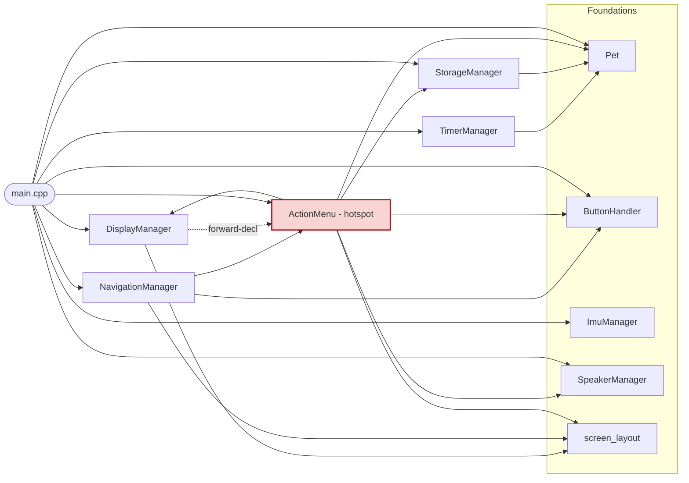

# Virtual Pet — Developer Roadmap

> **Audience:** Students of varying skill levels.
> **Hardware:** M5StickC Plus 2 (ESP32-PICO-V3-02, MPU6886, LCD 135×240, Buzzer, Microphone)
> **Pedagogical rules:** No clever syntax. Full descriptive names. Every function gets a comment.

---

## Part 1 — Audit: Completed vs. Missing Items

Items are mapped directly against `COURSE_CHECKLIST.md`.

### Phase 1: Foundations & UI

| Checklist Item | Status | Where It Lives |
|---|---|---|
| Hardware Initialization (M5.begin, LCD, Serial) | ✅ Done | `src/main.cpp` → `setup()`, `lib/Display/display_manager.cpp` → `init()` |
| Asset Pipeline (images/gifs → C++ arrays) | ✅ Done | `tools/piskel_converter/main.cpp` — C++ host-side converter (ARGB8888 → RGB565, byte-swapped for LCD byte order). `SPRITE_GUIDE.md` — student walkthrough. `assets/sprites/raw/` — raw Piskel .c exports. `lib/Display/sprites/` — converted .h files. `src/main.cpp` → `#define SPRITE_TEST` — bypass flag for isolated sprite rendering tests. Note: values are pre-swapped (0x1FF8 transparent key) to match the M5StickC Plus 2 LCD's big-endian byte-order expectation over SPI |
| Basic Sprite Rendering (draw pet to screen) | ✅ Done | `lib/Display/display_manager.cpp` → `drawPetSprite()` renders bitmap sprites via `M5.Lcd.pushImage()` with transparent key `0x1FF8`. Three sizes used: 64×64 on Main, 48×48 on Interact, 32×32 on Stats. Sprite assets in `lib/Display/sprites/`. The placeholder circle face (`drawPetFace()`) was removed |
| Screen Real Estate Management (stats zone vs. pet zone) | ✅ Done | `lib/Display/screen_layout.h` → `ScreenZone` / `StatBarZone` / `ScreenState` / `RelevantStat`. Zone constants in `display_manager.h`. Three-screen framework (Main, Stats, Interact) in `display_manager.cpp` → `renderMainScreen()` / `renderStatsScreen()` / `renderInteractScreen()`. Navigation in `lib/Navigation/navigation_manager.h/.cpp` |

### Phase 2: Core Logic & State Machine

| Checklist Item | Status | Where It Lives |
|---|---|---|
| State Machine Architecture (IDLE, EATING, SLEEPING, EVOLVING) | ✅ Done | `lib/Pet/pet.h` → `PetState` enum. `lib/Pet/pet.cpp` → `updateState()` / `setState()` / `getState()` |
| State Machine — Full Action Coverage (PLAYING, SICK, HEALING, BATHING) | ✅ Done | `lib/Pet/pet.h` → expanded `PetState` enum. `lib/Pet/pet.cpp` → new cases in `updateState()`, `setState()` wired into `play()`, `bathe()`, `heal()` |
| Hunger Logic (timer-based decrement) | ✅ Done | `lib/Timer/time_manager.cpp` → `applyHungerIncrease()` |
| Happiness Logic (timer-based decrement) | ✅ Done | `lib/Timer/time_manager.cpp` → `applyHappinessDecay()` |
| Energy/Sleep Logic (recovery vs. depletion) | ✅ Done | Auto-drain in `lib/Timer/time_manager.cpp` → `applyEnergyDrain()`. Manual recovery via `pet.cpp` → `sleep()` |
| Death/Reset Condition (handle 0 stats) | ✅ Done | `lib/Pet/pet.h` → `isDead()` / `reset()`. Death screen routed through `display_manager.cpp` → `renderDisplay()` |
| Cleanliness Decay Logic (timer-based decrement) | ✅ Done | `lib/Timer/time_manager.cpp` → `applyCleanlinessDecay()`. Drops by 1 every 10 seconds |
| Sickness Accumulation Logic (rises when cleanliness is low) | ✅ Done | `lib/Timer/time_manager.cpp` → `applySicknessAccumulation()`. Rises by 1 every 12 seconds when `cleanliness` is below 30 |
| Sadness Logic (rises when happiness is low) | ⏸ Deferred | `sad` stat, getter, setter, default constant already exist in `Pet`. Needs: a `TimerManager` rule to raise `sad` when `happy` falls below a threshold, and a sad sprite to display it. Revisit after the asset pipeline (Task 12) is complete |
| Cleanliness / Sickness Display | ✅ Done | Both bars shown in `display_manager.cpp` → `showPetStatus()`. Layout tightened to fit all five stats |

### Phase 3: Interaction & Menu System

| Checklist Item | Status | Where It Lives |
|---|---|---|
| Navigation Logic (B & C cycle, A confirms) | ✅ Done | `lib/Button/button_handler.cpp`, `lib/Actions/action_menu.cpp`, `src/main.cpp:33–49` |
| Menu UI (visual indicators for selected actions) | ✅ Done | `display_manager.cpp:96–108` → `drawMenuIndicator()` |
| Motion Play (MPU6886 accelerometer for Play mode) | ✅ Done | `lib/Imu/imu_manager.h/.cpp` → `ImuManager`. `wasShaken()` called in `src/main.cpp` → triggers `myPet.play()` |
| Sound Feedback (buzzer melodies) | ✅ Done | `lib/Speaker/speaker_manager.h/.cpp` — melodies for all 5 actions, death, reset, hunger alert, sickness alert |
| Voice Memos (microphone record/playback) | ❌ Missing | `lib/Microphone/microphone_manager.cpp` — empty |

### Phase 4: Environmental & Advanced Features

| Checklist Item | Status | Where It Lives |
|---|---|---|
| MPU6886 "Shake to Wake" (low-power wake) | 🚫 Removed | Hardware investigation confirmed the MPU6886 INT pin is not routed to an ESP32 GPIO on the M5StickCPlus2 — interrupt-driven wake is not possible on this board |
| RTC (Real Time Clock for overnight logic) | ❌ Missing | `lib/Timer/time_manager.cpp` exists (decay timers implemented) but RTC/BM8563 integration not started |
| NVS Persistence via `Preferences` (save pet on power-off) | ✅ Done | `lib/Storage/storage_manager.h/.cpp` — saves/loads all pet stats via Arduino `Preferences` (NVS). Wired into `setup()` (load) and Save action (write) in `src/main.cpp`. Note: this was originally labelled "EEPROM" but the ESP32 has no real EEPROM hardware — NVS is the correct native mechanism. |
| Evolution Logic (growth stages based on care/time) | ❌ Missing | No growth stage tracking in `Pet` class |

### Phase 5: Connectivity & Polish

| Checklist Item | Status | Where It Lives |
|---|---|---|
| Wireless Communication (BLE or WiFi) | ❌ Missing | Not started |
| Remote Dashboard (Web/App stat checking) | ❌ Missing | Not started |
| Final UI Polish (comments, descriptive names) | ⚠️ Partial | Existing code is reasonably documented. Magic pixel constants have been replaced with named constants. Bitmap sprites are done as of Task 13. Sprite animation (Task 13a) is deferred — picked back up after Tasks 15–18. |
| SpeakerManager refactor — playNote() helper | ⏸ Deferred | Every sound method repeats the same tone/delay/stop pattern. A `playNote(frequency, duration)` helper could eliminate the repetition. Intentionally left verbose for now so students can read each melody top to bottom without following abstractions. Revisit during the final polish pass. |

---

## Part 2 — Complexity Queue

Tasks ordered from **easiest** to **hardest** so a student always has a clear next step that builds on what they already know.

```
LEVEL 1 — COPY THE PATTERN (no new concepts)
  1. Happiness auto-decay timer        ✅ Done
  2. Energy auto-drain timer           ✅ Done
  3. Death / Reset condition           ✅ Done
 3a. Cleanliness decay timer           ✅ Done
 3b. Sickness accumulation timer       ✅ Done

LEVEL 2 — SMALL NEW CONCEPT
  4. State Machine Architecture        ✅ Done
 4b. Expand State Machine              ✅ Done
  5. Screen Real Estate constants      ✅ Done

LEVEL 3 — NEW HARDWARE API (library already in project)
  6. MPU6886 Motion Play               ✅ Done
  7. MPU6886 Shake to Wake             🚫 Removed — INT pin not routed on M5StickCPlus2
  8. Buzzer Sound Feedback             ✅ Done

LEVEL 4 — DATA + PLANNING
  9. State Machine Cleanup             ✅ Done (STATE_DEAD + alert timers moved from main into updateState)
  9a. Evolution Logic                  (deferred — age counter + growth stages, requires task 9 refactor)
  9b. Sadness Logic                    (deferred — sad rises when happy is low, needs sad sprite from task 12)
 10. NVS persistence via `Preferences`  ✅ Done (note: ESP32 has no real EEPROM — NVS is the native mechanism)

LEVEL 5 — ASSET PIPELINE
 11. Screen Real Estate layout zones   ✅ Done
11a. Multi-screen framework            ✅ Done (ScreenState enum, NavigationManager, three render methods in DisplayManager, contextual stat bar on Interact screen)
11b. Stats detail screen               ✅ Done (included in 11a — SCREEN_STATS reuses the original zone layout exactly)
11c. Pet interaction screens           ✅ Done (included in 11a — SCREEN_INTERACT shows pet face + contextual stat bar + action menu)
 12. Asset Pipeline (image → C array)  ✅ Done (C++ piskel_converter tool, SPRITE_GUIDE.md, SPRITE_TEST flag in main.cpp, byte-swap fix for M5StickC Plus 2 SPI byte order)
 13. Basic Sprite Rendering            ✅ Done (drawPetSprite via pushImage; three sprite sizes; placeholder circle face removed. Also fixed a converter bug: Piskel exports ABGR8888, not ARGB8888 — the channel extraction had red and blue swapped)
13a. Sprite Animation                  ⏸ Deferred — return after Level 6/7 features (Tasks 15–18). Multi-frame cycling using existing FRAME_COUNT dimension, millis() timer, optional M5Canvas double-buffer for flicker. Will run as the last Level 5 task before Task 19's pre-template simplification.
 14. Initial Simplification Pass       (umbrella — split into 14a code audit and 14b roadmap audit. Gate before Level 6 — streamline existing code AND right-size future tasks before any new features land.)
14a. Code Simplification Audit         (next — dead-code removal across lib/, module-coupling map, dead-overload / dead-member-variable / dead-enum audit. Surfaces findings; minimal refactor.)
14b. Roadmap Simplification Audit      (right-size Tasks 15–18 from "full reference feature" to "minimum teachable foundation students can expand". Output: amended task descriptions in this file. Examples to consider: basic mic input instead of voice memos; basic wireless scan instead of full BLE/WiFi communication; minimal static dashboard instead of full HTTP server.)

⚠️  INITIAL SIMPLIFICATION PASS REQUIRED BEFORE ANY NEW FEATURES
     The codebase has accumulated empty stub modules, unused public methods,
     and at least one dead function overload over the course of Levels 1–5.
     Before starting any Level 6 feature work, walk every module with the
     following questions in mind:
       — Is this file / method / overload actually used anywhere?
       — Are there overloaded functions whose signatures never match a caller?
       — Are any member variables, enum values, or struct fields dead?
       — Can any block of logic be re-written in fewer, clearer steps WITHOUT
         violating the pedagogical rules in CLAUDE.md?
     This is a smaller, narrower pass than Task 19. The goal here is only to
     remove junk and tighten what already exists — NOT to rewrite for teaching.
     New features (RTC, voice memos, networking) wait until this pass is done.

LEVEL 6 — COMPLEX HARDWARE
 15. RTC overnight logic               (new: I2C, BM8563 library, Unix timestamp math)
 16. Microphone Voice Memos            (new: DMA audio buffers — see Hardware Gotchas)

LEVEL 7 — NETWORKING
 17. Wireless Communication (BLE/WiFi) (new: WiFi.h, ESP-NOW or BLE library)
 18. Remote Dashboard                  (requires: task 17 + simple HTTP server)

PHASE 6 — STUDENT TEMPLATE CREATION (after fully functioning Tamagotchi is complete)

⚠️  SIMPLIFICATION PASS REQUIRED BEFORE ANY TEMPLATES ARE CREATED
     This codebase will be used as a teaching template for young children.
     Before templates are extracted, every module must be walked through and
     simplified with the following questions in mind:
       — Can this logic be written in fewer, clearer steps?
       — Are all variable and function names fully descriptive?
       — Does every function have a one-sentence comment explaining what it does AND why?
       — Are there any clever tricks, ternaries, or compact patterns a beginner would not understand?
       — Would a student with no prior C++ experience be able to read this and follow along?
     Simplicity is more important than elegance. If in doubt, expand it.

 19. Simplification pass — walk every module and simplify for teaching
     — Review all .h and .cpp files against the pedagogical rules in CLAUDE.md.
       Expand any compact or clever code into readable step-by-step form.
       Ensure every function has a comment. Remove any patterns that would
       confuse a beginner without prior C++ experience.
 20. Codebase review against lesson plan
     — Walk every module against the course checklist and confirm the reference
       implementation is clean, documented, and complete.
 21. Create skeleton templates per module
     — Strip core logic from each .cpp file, leaving function signatures, comments,
       and example implementations where needed to give students enough scaffolding.
       Students write their own logic inside the provided structure.
 22. Validate templates compile and are teachable
     — Each skeleton should compile without errors and give a student of the target
       skill level enough context to complete it without being lost.
 23. Organise templates by complexity level
     — One template set per Level (1–7) so teachers can assign tasks matched to
       each student's experience. Beginner students get Level 1–2 skeletons;
       advanced students get Level 4–7.
```

---

## Part 3 — Hardware Gotchas

These are real pitfalls that will cause mysterious bugs or crashes on the ESP32-PICO-V3-02. Read this section before attempting Levels 5–7.

---

### Gotcha 1 — Audio Buffer Memory on the ESP32-PICO-V3-02

**The problem:** The ESP32-PICO-V3-02 has 520 KB of internal SRAM, but the M5StickC Plus 2 display framebuffer and stack already consume a large chunk. If you allocate a large audio recording buffer on the stack (as a local array inside a function), the device will crash with a stack overflow — often with no error message.

**The rule:** Always allocate audio buffers on the **heap** using `malloc()` (or Arduino's `new`), and always **free** them when done. Never declare a large buffer like `int16_t recordingBuffer[8000]` inside a function.

```cpp
// BAD — this lives on the stack and will crash the device
void recordSound() {
    int16_t recordingBuffer[8000]; // ~16 KB on the stack — CRASH
}

// GOOD — this lives on the heap
void recordSound() {
    // Ask the heap for memory. Check that it succeeded before using it.
    int16_t* recordingBuffer = (int16_t*) malloc(8000 * sizeof(int16_t));

    if (recordingBuffer == nullptr) {
        // malloc returned null — not enough free memory
        Serial.println("ERROR: Not enough memory to record audio.");
        return;
    }

    // ... use recordingBuffer here ...

    // ALWAYS release heap memory when you are done with it
    free(recordingBuffer);
    recordingBuffer = nullptr; // Good habit: nullify the pointer after freeing
}
```

**Tip:** Call `ESP.getFreeHeap()` and print it via Serial before and after your recording function to make sure memory is being released correctly.

---

### Gotcha 2 — Non-Blocking Logic with `millis()` (Never Use `delay()` in the Main Loop)

**The problem:** `delay(1000)` pauses the entire program for 1 second. During that pause, button presses are ignored, the pet's face freezes, and the device feels "dead". This is called **blocking** code.

**The rule:** Use `millis()` to track time without stopping the program. The pattern is always the same three lines:

```cpp
// Declare a variable to remember when the last event happened.
// The word 'static' means it keeps its value between loop() calls.
static unsigned long lastHappinessDecayTime = 0;

// Inside loop() — check if enough time has passed
if (millis() - lastHappinessDecayTime >= 5000) {  // 5000 ms = 5 seconds
    // Do the timed action here
    myPet.setHappy(myPet.getHappy() - 1);

    // Remember when this last happened so the timer resets
    lastHappinessDecayTime = millis();
}
```

**This is the SAME pattern** used in `lib/Timer/time_manager.cpp` for both the hunger and happiness timers. Every timed feature in this project should use this pattern.

**Warning:** Never use `delay()` inside `loop()`, `update()`, or any function called from `loop()`. It is fine to use `delay()` once inside `setup()` for a startup message.

---

### Gotcha 3 — Screen Flicker Prevention with M5Canvas (Double-Buffering)

**The problem:** Calling `M5.Lcd.clear()` followed by multiple draw calls causes visible flickering because the screen is blank for a fraction of a second between clears and redraws. This is already partially managed by the 5-second `STATUS_UPDATE_INTERVAL` in `display_manager.cpp:48–53`, but for fast-moving animations it will not be enough.

**The solution:** Use `M5Canvas` as an off-screen buffer. You draw everything onto the invisible canvas first, then "push" the finished image to the screen in one fast operation. The screen never shows a blank intermediate state.

```cpp
#include "M5StickCPlus2.h"

// Create a canvas the same size as the screen
M5Canvas canvas(&M5.Lcd);

void setup() {
    M5.begin();
    // Tell the canvas how big to be (matches the screen: 135 wide, 240 tall)
    canvas.createSprite(135, 240);
}

void drawFrame() {
    // Step 1: Draw everything onto the INVISIBLE canvas (never shows flicker)
    canvas.fillSprite(TFT_BLACK);         // Clear the canvas with black
    canvas.drawCircle(67, 120, 25, TFT_WHITE); // Draw pet face onto canvas

    // Step 2: Push the finished canvas to the REAL screen all at once
    // Arguments: destination X, destination Y on the real screen
    canvas.pushSprite(0, 0);
}
```

**Memory note:** A full 135×240 canvas at 16-bit colour uses `135 × 240 × 2 = 64,800 bytes` (~63 KB) of heap. This is safe on the ESP32-PICO-V3-02 as long as you are not also holding a large audio buffer at the same time. If you run low on heap, reduce the canvas to cover only the animated region of the screen rather than the full display.

---

## Part 4 — Next Best Foundational Tasks

---

### Task 3a — Cleanliness Decay Timer ✅ Next

**Why this task next?**

`cleanliness` can already be increased by `bathe()`, but it never decreases on its own. The pet can stay perfectly clean forever without any effort, which makes the bathe action pointless. This task adds the missing decay timer using the exact same `millis()` pattern students have already seen three times in Tasks 1–3. No new concepts — just practice.

**Exactly where to add the code:**

Step 1 — Add the decay function declaration to `lib/Timer/time_manager.h`, alongside the existing timer declarations:
```cpp
// Decreases cleanliness over time so the pet gets dirty without bathing
void applyCleanlinessDecay(Pet& pet);
```

Step 2 — Add the implementation to `lib/Timer/time_manager.cpp`:
```cpp
// applyCleanlinessDecay()
// Decreases cleanliness by 1 every 8 seconds. The pet gets dirty over time
// and will need bathing, making the bathe action meaningful.
void TimerManager::applyCleanlinessDecay(Pet& pet) {
    static unsigned long lastCleanlinessDecayTime = 0;
    unsigned long cleanlinessDecayInterval = 8000;

    if (millis() - lastCleanlinessDecayTime >= cleanlinessDecayInterval) {
        pet.setCleanliness(pet.getCleanliness() - 1);
        lastCleanlinessDecayTime = millis();
    }
}
```

Step 3 — Call it inside `TimerManager::update()` in `time_manager.cpp`:
```cpp
applyCleanlinessDecay(pet);
```

**Files touched:** `lib/Timer/time_manager.h` and `lib/Timer/time_manager.cpp`.

---

### Task 3b — Sickness Accumulation Timer

**Why this task next?**

`sick` can only be decreased by `heal()`, but it never increases — the pet can never actually get sick. This task makes sickness a real threat by slowly increasing `sick` when `cleanliness` is low. It uses the same `millis()` timer pattern but introduces a simple conditional: the timer only fires when a condition is met. A natural next step after 3a.

**Exactly where to add the code:**

Step 1 — Add the declaration to `lib/Timer/time_manager.h`:
```cpp
// Increases sickness over time when the pet is dirty
void applySicknessAccumulation(Pet& pet);
```

Step 2 — Add the implementation to `lib/Timer/time_manager.cpp`:
```cpp
// applySicknessAccumulation()
// Increases sick by 1 every 10 seconds when cleanliness is below 30.
// A dirty pet gradually becomes unwell — bathing prevents this.
void TimerManager::applySicknessAccumulation(Pet& pet) {
    static unsigned long lastSicknessAccumulationTime = 0;
    unsigned long sicknessAccumulationInterval = 10000;
    int cleanlinessDangerThreshold = 30;

    if (pet.getCleanliness() < cleanlinessDangerThreshold) {
        if (millis() - lastSicknessAccumulationTime >= sicknessAccumulationInterval) {
            pet.setSick(pet.getSick() + 1);
            lastSicknessAccumulationTime = millis();
        }
    }
}
```

Step 3 — Call it inside `TimerManager::update()`:
```cpp
applySicknessAccumulation(pet);
```

**Files touched:** `lib/Timer/time_manager.h` and `lib/Timer/time_manager.cpp`.

---

### Task 4b — Expand State Machine (PLAYING, SICK, HEALING, BATHING)

**Why this task next?**

Task 4 added the state machine foundation but only wired two actions into it — `feed()` and `sleep()`. The remaining three care actions (`play()`, `bathe()`, `heal()`) still set no state, which means the switch handler can never react to them. This task closes that gap. The student already knows the enum and switch pattern from Task 4 — this is purely practice: add four more states, four more cases, and four more `setState()` calls.

**Exactly where to add the code:**

Step 1 — Add the four new states to the `PetState` enum in `lib/Pet/pet.h`:
```cpp
enum PetState {
    STATE_IDLE,      // Default — pet is awake but doing nothing
    STATE_EATING,    // Triggered by feed() — pet is eating
    STATE_SLEEPING,  // Triggered by sleep() — pet is resting
    STATE_PLAYING,   // Triggered by play() — pet is exercising
    STATE_SICK,      // Entered automatically when sick stat is high — pet is unwell
    STATE_HEALING,   // Triggered by heal() — pet is receiving treatment
    STATE_BATHING,   // Triggered by bathe() — pet is being cleaned
    STATE_EVOLVING   // Reserved for future evolution logic (task 9)
};
```

Step 2 — Add the four new cases to the switch in `Pet::updateState()` in `pet.cpp`:
```cpp
case STATE_PLAYING:
    // Playing is handled instantly by play() — return to idle
    setState(STATE_IDLE);
    break;

case STATE_SICK:
    // Pet stays sick until heal() is called — no automatic return to idle
    break;

case STATE_HEALING:
    // Healing is handled instantly by heal() — return to idle
    setState(STATE_IDLE);
    break;

case STATE_BATHING:
    // Bathing is handled instantly by bathe() — return to idle
    setState(STATE_IDLE);
    break;
```

Step 3 — Wire `setState()` calls into the remaining actions in `pet.cpp`:
```cpp
void Pet::play() {
    setState(STATE_PLAYING);   // <-- add this line
    happy     = happy     + 25;
    tired     = tired     + 20;
    energised = energised - 20;
    hungry    = hungry    + 15;
    constrainValues();
}

void Pet::bathe() {
    setState(STATE_BATHING);   // <-- add this line
    cleanliness = cleanliness + 30;
    tired       = tired       + 10;
    energised   = energised   - 10;
    constrainValues();
}

void Pet::heal() {
    setState(STATE_HEALING);   // <-- add this line
    sick  = sick  - 50;
    tired = tired + 20;
    happy = happy - 5;
    constrainValues();
}
```

Step 4 — Enter `STATE_SICK` automatically when `sick` is high. Add this check inside the `STATE_IDLE` case in `Pet::updateState()`:
```cpp
case STATE_IDLE:
    // If the sick stat is dangerously high, transition to the sick state automatically
    if (sick >= 50) {
        setState(STATE_SICK);
    }
    break;
```

**Files touched:** `lib/Pet/pet.h` and `lib/Pet/pet.cpp`.

---

### Task 5 — Screen Real Estate Constants

**Why this task?**

`display_manager.cpp` currently uses raw pixel numbers like `5`, `36`, `125`, and `152` scattered across several functions. These are called **magic numbers** — numbers with no explanation of what they represent. If a student wants to move the pet face down by 10 pixels, they have to hunt through the file to find every related number and hope they don't miss one. Named constants fix this: change the value in one place, and it updates everywhere.

**New concept introduced:** `static const` class members in a header file. The `static` keyword means the constant belongs to the class itself, not to any single object — every `DisplayManager` instance shares the same value without wasting extra memory.

**Exactly where to add the code:**

Step 1 — Add the layout constants to the `private:` section of `DisplayManager` in `lib/Display/display_manager.h`, below the existing `SCREEN_WIDTH` and `SCREEN_HEIGHT` constants:

```cpp
// Shared left margin and width used by every stat bar and label
static const int STAT_LEFT_MARGIN = 5;
static const int STAT_BAR_WIDTH   = 125;

// Y position of each stat label, and the bar drawn 10 px below it
static const int HAPPY_LABEL_Y  = 26;
static const int HAPPY_BAR_Y    = 36;
static const int HUNGER_LABEL_Y = 48;
static const int HUNGER_BAR_Y   = 58;
static const int ENERGY_LABEL_Y = 70;
static const int ENERGY_BAR_Y   = 80;
static const int CLEAN_LABEL_Y  = 92;
static const int CLEAN_BAR_Y    = 102;
static const int SICK_LABEL_Y   = 114;
static const int SICK_BAR_Y     = 124;

// Pet face drawn below the five stat bars
static const int PET_FACE_Y      = 152;
static const int PET_FACE_RADIUS = 18;

// Mood text printed just below the pet face
static const int MOOD_TEXT_Y = 180;

// Menu indicator strip pinned to the bottom of the screen
static const int MENU_INDICATOR_X      = 5;
static const int MENU_INDICATOR_Y      = 220;
static const int MENU_INDICATOR_WIDTH  = 130;
static const int MENU_INDICATOR_HEIGHT = 20;
```

Step 2 — In `lib/Display/display_manager.cpp`, replace the raw numbers in `showPetStatus()` with the new constants:

```cpp
// Before (magic numbers)
M5.Lcd.setCursor(5, 26);
drawStatusBar(happiness, 100, 5, 36, 125, TFT_GREEN);

// After (named constants)
M5.Lcd.setCursor(STAT_LEFT_MARGIN, HAPPY_LABEL_Y);
drawStatusBar(happiness, 100, STAT_LEFT_MARGIN, HAPPY_BAR_Y, STAT_BAR_WIDTH, TFT_GREEN);
```

Repeat for all five stats (Hunger, Energy, Clean, Sick) using the matching `_LABEL_Y` and `_BAR_Y` constants.

Step 3 — Replace magic numbers in `showPetMood()`:

```cpp
// Before
printCenteredText(moodText, 180, moodColor, 2);

// After
printCenteredText(moodText, MOOD_TEXT_Y, moodColor, 2);
```

Step 4 — Replace magic numbers in `drawPetFace()`:

```cpp
// Before
int faceY = 152;
int faceRadius = 18;

// After
int faceY = PET_FACE_Y;
int faceRadius = PET_FACE_RADIUS;
```

Step 5 — Replace magic numbers in `drawMenuIndicator()`:

```cpp
// Before
fillRect(x, y, 130, 20, TFT_BLACK);
M5.Lcd.drawRect(x, y, 130, 20, TFT_CYAN);

// After
fillRect(x, y, MENU_INDICATOR_WIDTH, MENU_INDICATOR_HEIGHT, TFT_BLACK);
M5.Lcd.drawRect(x, y, MENU_INDICATOR_WIDTH, MENU_INDICATOR_HEIGHT, TFT_CYAN);
```

Step 6 — Replace the hardcoded call site in `renderDisplay()`:

```cpp
// Before
drawMenuIndicator(menu, 5, 220);

// After
drawMenuIndicator(menu, MENU_INDICATOR_X, MENU_INDICATOR_Y);
```

**Files touched:** `lib/Display/display_manager.h` and `lib/Display/display_manager.cpp`.

---

### Task 11 — Screen Real Estate Layout Zones ✅ Done

**Why this task?**

Task 5 was a good first step — it replaced raw numbers with named constants. But nineteen separate constants in a flat list still don't tell a student *which part of the screen* each number belongs to. `HAPPY_LABEL_Y` and `MENU_INDICATOR_X` sit next to each other in the header with no visible relationship to the physical regions they describe.

This task groups those constants into five named **zone structs**, one per logical region of the screen. A student reading the header now sees the screen divided into five clearly labelled pieces before they read a single draw call.

**New concept introduced: plain structs and `constexpr`**

A `struct` is a bundle of related values with named fields. You have already seen one in the project — `struct Action` in `lib/Actions/action_menu.h` bundles `type`, `name`, and `description` together. `ScreenZone` and `StatBarZone` follow exactly the same idea, but with only integers.

`static constexpr` is used instead of `static const` because `static const` only works inline in a class for integer types. For struct types, C++ needs `constexpr` to evaluate the value at compile time. The end result is identical — zero runtime cost, just a different keyword.

**The five zones and what lives in each**

```
┌─────────────────────────────┐  Y=0
│        TITLE_ZONE           │  Y=5  — pet name, centred, yellow size-2
├─────────────────────────────┤  Y=26
│        STATS_ZONE           │  5 stat label+bar pairs, stacked 22px apart
│   Happy  ░░░░░░░░░░░░░░     │  Y=26–36
│   Hunger ░░░░░░░░░░░░░░     │  Y=48–58
│   Energy ░░░░░░░░░░░░░░     │  Y=70–80
│   Clean  ░░░░░░░░░░░░░░     │  Y=92–102
│   Sick   ░░░░░░░░░░░░░░     │  Y=114–124
├─────────────────────────────┤  Y=134
│      PET_FACE_ZONE          │  circle centred at PET_FACE_ZONE.y + PET_FACE_RADIUS = 152
│           O                 │
│         (   )               │
│           -                 │
├─────────────────────────────┤  Y=180
│        MOOD_ZONE            │  dominant mood text, centred, size-2
├─────────────────────────────┤  Y=220
│        MENU_ZONE            │  Action: <name>  (cyan box, 130×20)
└─────────────────────────────┘  Y=240
```

**How visual information flows into each zone**

Every frame, `renderDisplay()` in `display_manager.cpp` orchestrates the screen in this order:

1. `showPetStatus()` — draws the pet name into `TITLE_ZONE`, then draws all five stat bars using `STATS_ZONE.x` for the left edge, `STATS_ZONE.width` for bar width, and each `*_BAR_ZONE.labelY` / `.barY` for vertical positions.
2. `showPetMood()` — draws the mood text at `MOOD_ZONE.y`, then calls `drawPetFace()` which centres the circle at `PET_FACE_ZONE.y + PET_FACE_RADIUS`.
3. `drawMenuIndicator()` — draws the bottom strip using `MENU_ZONE.x`, `.y`, `.width`, and `.height`.

Each function only touches its own zone. None of them know about the others' coordinates. If you want to move the entire stats section down by 10 pixels, you change `STATS_ZONE.y` in the header and every bar label and bar position moves together automatically.

**The pet name**

The title bar now shows the pet's name instead of the hardcoded string "Virtual Pet". The name "Pixel" is stored in the `Pet` class as a `const char*` member, initialised in the constructor. `getPetName()` returns it, and `main.cpp` passes it to `renderDisplay()`, which forwards it to `showPetStatus()`. The display knows nothing about how the name is stored — it just draws whatever string it receives.

**Files touched:** `lib/Display/screen_layout.h` (new), `lib/Display/display_manager.h`, `lib/Display/display_manager.cpp`, `lib/Pet/pet.h`, `lib/Pet/pet.cpp`, `src/main.cpp`.

---

### Task 8 — Buzzer Sound Feedback ✅ Done

**Why this task?**

The pet could already show what it was doing on screen, but gave no audio cue. This task fills in `lib/Speaker/speaker_manager.h/.cpp` and wires it into the action menu and main loop so every care action, every alert, and the death/reset lifecycle each play a distinct melody. It introduces a new hardware API (`M5.Speaker.tone()`) and teaches the difference between blocking sound calls (acceptable inside `confirmAction()`) and non-blocking alert patterns (millis()-debounced in the main loop).

**Architecture — what was added:**

`SpeakerManager` follows the same single-responsibility pattern as every other `lib/` module. It has one job: play sounds. It knows nothing about pet stats or the display.

| Method | When it fires |
|---|---|
| `init()` | Once in `setup()` — sets speaker volume |
| `playFeedSound()` | Inside `confirmAction()` when FEED is selected |
| `playPlaySound()` | Inside `confirmAction()` when PLAY is selected |
| `playSleepSound()` | Inside `confirmAction()` when SLEEP is selected |
| `playBatheSound()` | Inside `confirmAction()` when BATHE is selected |
| `playHealSound()` | Inside `confirmAction()` when HEAL is selected |
| `playDeathSound()` | Once in `loop()` when `isDead()` becomes true (static flag prevents replaying) |
| `playResetSound()` | In `loop()` when Button A is pressed on the death screen |
| `playHungerAlertSound()` | In `loop()` via millis() timer — at most once every 15 s when `hungry >= 80` |
| `playSicknessAlertSound()` | In `loop()` via millis() timer — at most once every 15 s when `sick >= 80` |

**Step 1 — Fill in `lib/Speaker/speaker_manager.h`:**

Declare `SpeakerManager` with `init()` and one named method per event. Keep the names descriptive so a student reading the call site immediately understands what sound will play.

**Step 2 — Fill in `lib/Speaker/speaker_manager.cpp`:**

Implement each method using `M5.Speaker.tone(frequency, duration)`. Each method plays 2–4 notes chosen to match the mood of the event. See `USEFUL_NOTES.md` for a full explanation of how frequencies map to musical notes.

**Step 3 — Update `lib/Actions/action_menu.h`:**

Add `#include "../Speaker/speaker_manager.h"` and update the `confirmAction()` signature to accept a `SpeakerManager&` parameter.

**Step 4 — Update `lib/Actions/action_menu.cpp`:**

In `confirmAction()`, add a `switch` on `selectedAction.type` after `executePetAction()`. Call the matching sound method for each action type.

**Step 5 — Update `src/main.cpp`:**

- Add `#include "../lib/Speaker/speaker_manager.h"` and a `SpeakerManager speaker;` global.
- Call `speaker.init()` in `setup()` after `M5.begin()`.
- Add a `static bool deathSoundPlayed` flag inside the `isDead()` block to play the death melody once and the reset fanfare on revival.
- Add two millis()-debounced alert blocks after `timers.update()` — one for hunger, one for sickness.
- Update the `confirmAction()` call to pass `speaker` as the third argument.

**Files touched:** `lib/Speaker/speaker_manager.h`, `lib/Speaker/speaker_manager.cpp`, `lib/Actions/action_menu.h`, `lib/Actions/action_menu.cpp`, `src/main.cpp`.

---

### Task 13a — Sprite Animation ⏸ Deferred

**Execution order note:**

This task is paused. The original ordering was Task 13 → Task 13a → Task 14, but in practice Task 14 (the simplification pass) runs first, then Tasks 15–18 (the right-sized Level 6/7 features), and Task 13a is picked back up immediately before Task 19's pre-template simplification. The numbering is kept as 13a (rather than renumbering to ~18a) because animation is logically a continuation of the Level 5 sprite work, even though its execution slot has moved.

When this task does run, the implementation guidance below remains accurate — the codebase will look slightly different (post-simplification) but `drawPetSprite()` and the sprite header shape will not have changed.

**Why this task at all?**

Task 13 landed static bitmap sprites — every screen shows a still image. The asset pipeline already supports multi-frame sprites: `tools/piskel_converter` reads however many frames Piskel exports and emits a `sprite_xxx[FRAME_COUNT][W*H]` array. Today every call site indexes frame `[0]` because that is all that has been drawn. The infrastructure for animation is therefore already in place — the work of Task 13a is to (a) draw multi-frame sprites in Piskel, (b) cycle through frames at runtime using `millis()` without blocking the rest of the loop, and (c) address the visible flicker that becomes apparent at animation frame rates.

This is a natural pedagogical follow-on to Task 13 — students learned `pushImage()` with one frame; here they learn frame-cycling and the non-blocking timer pattern that already powers stat decay. No new hardware, no new libraries.

**What the task delivers:**

1. **A multi-frame sprite for at least one pet state.** Start with idle — a gentle 2-frame bounce or blink is enough to prove the pipeline. Drawn in Piskel, exported, converted with the existing tool. Confirms the converter's `FRAME_COUNT > 1` path works on real art.
2. **Frame-cycling logic in `DisplayManager`.** Add a `currentFrame` member, a `lastFrameAdvanceTime` member, and a `FRAME_DURATION_MS` constant (suggest 200 ms = 5 fps as a kid-friendly starting point). On each `drawPetSprite()` call, advance the frame index if enough time has elapsed since the last advance. Index the sprite as `spriteData[currentFrame]` instead of `spriteData[0]`. Reset `currentFrame` to 0 on screen transitions so animations restart cleanly.
3. **Flicker mitigation (only if needed).** Hardware Gotcha 3 in Part 3 of this roadmap documents the `M5Canvas` double-buffer pattern. For small face areas (≤64×64) the simpler `pushImage()` approach may still look acceptable — benchmark first, only introduce the canvas if you can see tearing. A full-screen canvas costs ~63 KB of heap; a sprite-sized canvas costs proportionally less.

**Concrete starting points:**

- `lib/Display/display_manager.h` — add `unsigned long lastFrameAdvanceTime;` and `int currentFrame;` to the private state block. Add `static const unsigned long FRAME_DURATION_MS = 200;` near the other timing constants.
- `lib/Display/display_manager.cpp` — extend `drawPetSprite()` to take a `frameCount` parameter so it knows how many frames the sprite has. Advance `currentFrame` using `(millis() - lastFrameAdvanceTime >= FRAME_DURATION_MS)` and wrap with `currentFrame % frameCount`. Reset `currentFrame` to 0 whenever `lastRenderedScreen` changes.
- `lib/Display/sprites/` — drop in the new multi-frame `.h` file generated from a fresh Piskel export. The converter already produces the right shape; the only difference is `FRAME_COUNT > 1`.
- `SPRITE_GUIDE.md` — add a new Part covering animation rules: anchor the silhouette so the pet does not appear to teleport between frames, two-pixel motion minimum so movement reads at 5 fps, ping-pong loops for clean idle animations, and the frame budget table already in Part 4.

**Beyond the minimum — also consider:**

- **Per-mood animation:** wire the existing `moodIndex` parameter (currently reserved but unused inside `drawPetSprite()`) to switch which animated sprite is drawn. Requires per-mood multi-frame art.
- **Per-state animation:** same idea but driven by `Pet::getState()` (`STATE_EATING`, `STATE_SLEEPING`, etc.). A larger art workload.
- **Variable frame rate per state:** idle = slow blink (2 fps), eating = bouncing (10 fps). Replace the single global `FRAME_DURATION_MS` with a per-state lookup.

**What this task is NOT:**

- It is **not the simplification pass** — that is Task 14. Do not delete unused code here, even if you notice some.
- It is **not per-mood or per-state animation by default.** The minimum deliverable is one animated sprite shown on at least one screen. Multi-mood animation is optional polish.
- It is **not sound-synced animation.** Buzzer playback is decoupled from sprite frames; the two are not coordinated in this task.

**Branch and commit strategy:**

Create `task/13a-sprite-animation` from a clean `main` after Task 18 is merged (per the deferred execution order — see the note at the top of this section). Suggested commits:

1. `chore: add multi-frame Piskel export and converted sprite header for idle state`
2. `feat: cycle pet sprite through frames using a millis() timer`
3. `docs: add animation guidance to SPRITE_GUIDE.md`
4. (optional, only if flicker is visible) `feat: use M5Canvas double-buffer to prevent animation flicker`
5. `docs: mark Task 13a done and advance next-task pointer to Task 19`

After all commits, test on device — the sprite must animate smoothly without affecting button responsiveness, IMU shake detection, sound playback, NVS save/load, or any other timed behaviour. The non-blocking timer is the test that matters: if pressing B during an animation feels laggy, the loop is being blocked somewhere it should not be.

**Files touched:** `lib/Display/display_manager.h`, `lib/Display/display_manager.cpp`, one or more new files in `lib/Display/sprites/`, raw `.c` files in `assets/sprites/raw/`, `SPRITE_GUIDE.md`. Possibly Hardware Gotcha 3 in Part 3 of this roadmap if the M5Canvas pattern needs additional notes after real-world use.

---

### Task 14 — Initial Simplification Pass (umbrella)

After Task 13 lands, the Tamagotchi has the features it needs to function as a complete teaching artefact — five care actions, three screens, sprites, sound, persistence, motion. Sprite animation (Task 13a) is intentionally deferred until after Levels 6/7 so that the simplification pass can run against today's stable codebase rather than chasing a moving target. Before adding RTC, microphone, or networking features on top, pause and (a) remove the junk that accumulated in the code while Levels 1–5 were built, and (b) re-examine the rest of the roadmap and decide which upcoming tasks are over-scoped for a teaching codebase.

Task 14 is split into two sub-tasks. **Task 14a — Code Simplification Audit** removes dead code and maps module coupling. **Task 14b — Roadmap Simplification Audit** rewrites Tasks 15–18 to the minimum teachable foundation that students can expand from. Run them in order (14a, then 14b). Each is its own branch and its own merge.

Both passes are **smaller and narrower** than the pre-template simplification at Task 19. Task 19 is a deep rewrite for pedagogy that touches every line. Task 14 only removes junk, surfaces coupling, and right-sizes future scope.

---

### Task 14a — Code Simplification Audit

**Why this sub-task:**

Empty stubs, unused methods, and dead overloads make the project feel cluttered and lead students to study code that does nothing. This sub-task removes the junk that the dead-code audit has already identified, and walks the codebase for additional findings. Module coupling is **surfaced but not refactored** — that decision belongs to Task 19 once the prerequisite-course context tells us which couplings will actually trip students up.

**Before starting this sub-task — gather the prerequisite course context.**

Ask the user to share the two markdown files outlining the programming courses that students complete before this Tamagotchi course. Those files describe what concepts students already know — variable types, control flow, functions, basic OOP, etc. The simplification decisions in this pass should be informed by that gap: code that uses concepts students have already learned can stay readable as-is, while code that uses C++ idioms they have not encountered yet is the first candidate for expansion, a longer comment, or a renamed variable. Do not start the audit until those files are in the conversation.

**Concrete starting points (from the dead-code audit run on 2026-05-09):**

Line numbers below are accurate as of the audit. Re-grep before deleting in case Tasks 13 or 13a have shifted them.

- `lib/Interactions/` — four 0-byte files: `action_manager.h`, `action_manager.cpp`, `intput_handler.h` (note typo), `input_handler.cpp`. Included nowhere. Delete the whole directory.
- `lib/Display/animation_manager.h` and `animation_manager.cpp` — both 0 bytes, included nowhere. Delete.
- `lib/Microphone/microphone_manager.h` and `microphone_manager.cpp` — both 0 bytes, included nowhere. Delete. (Task 16 will create the module fresh when voice memos are implemented.)
- `ButtonHandler::isButtonAHeld() / isButtonBHeld() / isButtonCHeld()` — declared at `lib/Button/button_handler.h:57–59`, implemented in the .cpp, never called. Remove declarations and definitions.
- `ImuManager::getAccelX() / getAccelY() / getAccelZ()` — declared at `lib/Imu/imu_manager.h:55–57`, never called. Only `wasShaken()` is used. Remove declarations and definitions.
- `ActionMenu::displayCurrentMenu()` — declared at `lib/Actions/action_menu.h:86`, self-flagged "legacy, mostly unused" in its header comment, never called. Remove.
- `ActionMenu::drawMenuIndicator()` — declared at `lib/Actions/action_menu.h:90`, never called. (`DisplayManager::drawMenuIndicator()` is the live implementation — keep that one.) Remove the ActionMenu version only.
- `DisplayManager::printText(String, ...)` — declared at `lib/Display/display_manager.h:102`, defined at `display_manager.cpp:310–315`. All four call sites pass `const char*` (string literals or `Action::name` which is `const char*` per `action_menu.h:41`); the `String` overload is unreachable. Remove the overload — keep the `const char*` overload at `display_manager.h:101`.
- Update the architecture map in `CLAUDE.md` to drop the `animation_manager` and `microphone_manager` rows now that those files are gone.

**Beyond the audit findings — also look for:**

- Other overloaded methods whose signatures may never bind. For each overload set in the project, check the static type of every argument at every call site.
- Member variables written but never read. The `Pet::tired` field is one candidate — it is persisted via `StorageManager` but never consulted by game logic, mood calculation, or rendering. Decide: wire it into a timer rule, or remove it. (Note: `Pet::sad` is also currently inert but is intentionally reserved for the deferred Sadness Logic task — leave it alone.)
- Enum values, struct fields, or constants that no `switch` / conditional / draw call ever references.
- Logic duplicated verbatim between two modules.
- **Module-to-module coupling.** Walk each module's public API and identify how it is called from other modules. Flag places where a single function takes multiple manager references (e.g. `ActionMenu::confirmAction(Pet&, DisplayManager&, SpeakerManager&, StorageManager&)`), where one module reaches deep into another's internals, or where two modules share state that could be owned by one. Produce a written list of coupling candidates — but **do not refactor them in this pass**. Surfacing the coupling map is the deliverable; Task 19's pre-template rewrite will use that list to decide which couplings are worth changing for teaching clarity.

**What this pass is NOT:**

- It is **not a rewrite**. Do not rename variables for taste, do not collapse readable blocks into clever one-liners, do not introduce new abstractions. The pedagogical rules in `CLAUDE.md` still apply — readability first.
- It is **not the pre-template polish** (that is Task 19). Do not normalise comments or extract helpers for teaching here.
- It is **not feature work**. Do not add new behaviour, even if it feels small.

**Branch and commit strategy:**

Create `refactor/14a-code-simplification` from a clean `main` after Task 13 is merged. Make one logical commit per concern (per the atomic-commit rule in `CLAUDE.md`):

1. `chore: remove empty lib/Interactions/ module`
2. `chore: remove empty animation_manager and microphone_manager stubs`
3. `refactor: remove unused ButtonHandler held-state methods`
4. `refactor: remove unused ImuManager raw acceleration getters`
5. `refactor: remove dead ActionMenu legacy methods`
6. `refactor: remove dead DisplayManager::printText(String) overload`
7. `docs: drop deleted modules from CLAUDE.md architecture map`
8. (further commits as additional findings surface during the pass)

After all commits, test on device — display, button input, IMU shake, sound, NVS save/load, all five care actions, and death/reset must behave exactly as before. The deletions should not change observable behaviour.

**Files touched:** Varies — entire `lib/` tree is in scope. Expect to delete files in `lib/Interactions/`, `lib/Display/animation_manager.*`, `lib/Microphone/microphone_manager.*`, and remove dead methods from `lib/Button/button_handler.*`, `lib/Imu/imu_manager.*`, `lib/Actions/action_menu.*`, `lib/Display/display_manager.*`. Also update `CLAUDE.md`.

---

### Task 14b — Roadmap Simplification Audit

**Why this sub-task:**

The remaining roadmap tasks (15–18) were written when this codebase was being thought of as a fully-featured reference implementation. As a teaching codebase the goal is different: each module should be a **teachable foundation that students can expand**, not a complete production feature. Several upcoming tasks are over-scoped for that purpose and should be slimmed down *before* they are started, so we do not invest in features students will rewrite anyway during the template stage.

This sub-task is **roadmap maintenance, not implementation work.** No code in `lib/` or `src/` is touched. The deliverable is amended task descriptions in this file (and, where applicable, `COURSE_CHECKLIST.md`).

**Before starting this sub-task:**

Have the two prerequisite-course markdown files from Task 14a's kickoff still in the conversation. The scope decisions here depend on knowing what students will already be comfortable with and where they will need scaffolding.

**Concrete starting points — candidate scope reductions:**

These are pre-flagged for the audit. Use them as a starting point; the audit may surface others.

- **Task 16 — currently "Microphone Voice Memos".** Probably over-scoped. Voice memo recording + playback needs DMA audio buffers, heap allocation gymnastics (see Hardware Gotcha 1), and a UI for browsing recordings. A more teachable foundation: detect a loud noise (clap, voice spike, whistle) via the microphone and have the pet react — wake up, look towards the noise, briefly increase happiness. Recording + playback becomes a stretch task students can add. Suggested renamed title: *"Microphone Input (Basic Reactions)"*.

- **Task 17 — currently "Wireless Communication (BLE/WiFi)".** The current description ("WiFi.h, ESP-NOW or BLE library") names libraries but does not pick a concrete deliverable. A teachable foundation could be: connect to a known WiFi network from a config-defined SSID/password and print the assigned IP address to Serial, *or* scan for nearby BLE devices and display the count on the LCD. Two-device communication and protocol design become stretch tasks. Pick **one** of WiFi or BLE for the foundation, not both — the second can be a stretch task.

- **Task 18 — currently "Remote Dashboard".** This task depends on whatever Task 17 actually becomes. If Task 17 only does WiFi connect, the foundation here could be: serve one static HTML page that shows the pet's current stats. Live updates via JSON APIs, polling intervals, and a mobile-friendly UI all become stretch tasks. If Task 17 picks BLE instead, this task might be dropped or merged into Task 17.

**Beyond those three — also re-examine:**

- Whether any current Phase 6 template task (19–23) needs its scope adjusted given the new shape of 15–18.
- Whether any of the already-completed tasks have features that should be removed in the same simplification spirit. Be cautious — completed work is harder to remove than to scope down before it lands.
- Whether `COURSE_CHECKLIST.md` items need their wording updated to match any renamed tasks.

**What this sub-task is NOT:**

- It is **not implementation work**. Nothing in `lib/` or `src/` changes.
- It is **not a rename for taste**. Only retitle a task if its scope is materially changing.
- It is **not the place to add new tasks**. If a stretch-task list emerges, it goes in an appendix at the bottom of this file, not into the main queue.

**Branch and commit strategy:**

Create `refactor/14b-roadmap-simplification` from a clean `main` after Task 14a is merged. One commit per task being right-sized, plus a final commit re-pointing the next-task pointer:

1. `docs: scope down Task 16 from voice memos to basic microphone input`
2. `docs: scope down Task 17 to single-protocol wireless foundation`
3. `docs: scope down Task 18 to static stats page`
4. (further commits as the audit surfaces additional findings)
5. `docs: mark Task 14b done and advance next-task pointer to Task 15`

After all commits, the roadmap should read end-to-end as a coherent teaching plan: every remaining task should be sized so a student-of-target-skill-level could complete it in a session, with explicit "stretch tasks" listed for advanced students who finish early.

**Files touched:** `DEV_ROADMAP.md` (primarily), `COURSE_CHECKLIST.md` (if any wording shifts), `CLAUDE.md` (next-task pointer, possibly architecture map if any module's purpose is being redefined).

---

## Appendix A — Module Coupling Map (Task 14a output)

This appendix is the deliverable of Task 14a's coupling sweep. It is a snapshot
of *which modules depend on which other modules and how heavily*, taken after
the 14a deletions and refactors landed. The job here is to **surface** coupling
so Task 19's pre-template rewrite can decide what to fix; nothing here has been
refactored.

Read order: the dependency diagrams first (who depends on whom), then the
coupling hotspots, ordered loudest first.

### A.1 — Module dependency diagram

The graph below shows which module includes (or takes a reference to) which
other module. An arrow `A ──► B` means "A's header includes B's header, or
A's methods take B by reference/value." Modules with **no outgoing arrows**
are *foundation modules* — nothing inside the project is required to compile
them.



If your viewer does not render Mermaid, the same graph in flat layered form:

```
Layer 0 — Foundations (no internal dependencies)
═══════════════════════════════════════════════════
   Pet      ButtonHandler   ImuManager   SpeakerManager   screen_layout


Layer 1 — Single-dependency managers
═══════════════════════════════════════════════════
   TimerManager     ──►  Pet
   StorageManager   ──►  Pet
   DisplayManager   ──►  screen_layout   (+ forward-decl ActionMenu ↩ Hotspot 2)


Layer 2 — Coordinator
═══════════════════════════════════════════════════
   NavigationManager  ──►  screen_layout, ButtonHandler, ActionMenu


Layer 3 — HOTSPOT  ★ (six internal dependencies)
═══════════════════════════════════════════════════
   ActionMenu  ──►  Pet, DisplayManager, screen_layout,
                    ButtonHandler, SpeakerManager, StorageManager


Layer 4 — Orchestrator
═══════════════════════════════════════════════════
   main.cpp  ──►  owns one instance of every manager and Pet
```

Five modules are foundations. `ActionMenu` sits at the opposite end with six
internal dependencies. The other four mid-tier modules sit between with one
to three.

### A.2 — Hotspot 1 — `ActionMenu::confirmAction` fan-in

The single highest-coupling surface in the codebase. To call it, `main.cpp`
must already own four other manager objects, and to *read* its body a student
must already understand four other classes.

```
                           main.cpp
                              │
                              │ calls menu.confirmAction(pet, display, speaker, storage)
                              ▼
                  ┌──────────────────────┐
                  │   ActionMenu         │
                  │   confirmAction(...) │
                  └──┬────┬────┬────┬────┘
                     │    │    │    │
            ┌────────┘    │    │    └────────┐
            ▼             ▼    ▼             ▼
         ┌─────┐     ┌────────┐ ┌───────┐ ┌────────┐
         │ Pet │     │Display │ │Speaker│ │Storage │
         └─────┘     └────────┘ └───────┘ └────────┘
         feed/play/  showAction  playFeed  save
         sleep/etc.  Feedback    Sound...
```

Inside the switch, each of the four managers is used for a different reason:

| Case | Pet | DisplayManager | SpeakerManager | StorageManager |
|---|---|---|---|---|
| FEED / PLAY / SLEEP / BATHE / HEAL | state change | feedback | sound | — |
| SAVE | — | feedback | sound | save |
| BACK | — | — | — | — |

**Why it ended up here:** five care actions, plus the special SAVE case, plus
the post-action feedback message — naturally lived in one place, and the
simplest way to do it was to give `confirmAction` every manager it might need.

**What Task 19 could consider:** split into per-concern methods
(`executeAction(pet)`, `playActionSound(speaker)`, `showFeedback(display)`)
and let `main.cpp` orchestrate them in sequence, OR move the orchestration
into a thin coordinator the student reads top-to-bottom. Either approach
drops `ActionMenu`'s internal dependencies from six to two or three. The
trade-off is more lines in `main.cpp` — possibly the wrong place to grow
complexity for beginners.

### A.3 — Hotspot 2 — `ActionMenu` ↔ `DisplayManager` circular knowledge

`action_menu.h` includes `display_manager.h` because `confirmAction` takes a
`DisplayManager&`. `display_manager.h` forward-declares `ActionMenu` because
three of its methods take `const ActionMenu&`:

- `renderDisplay(... const ActionMenu& menu, ...)`
- `renderInteractScreen(... const ActionMenu& menu, ...)`
- `drawMenuIndicator(const ActionMenu& menu, int x, int y)`

```
                #include "display_manager.h"
        ┌──────────────────────────────────────┐
        │                                      ▼
   ┌──────────┐                          ┌──────────┐
   │ActionMenu│                          │ Display  │
   │          │◄ ─ ─ ─ ─ ─ ─ ─ ─ ─ ─ ─ ─ │ Manager  │
   └──────────┘    forward-declare       └──────────┘
                  class ActionMenu;
                  (workaround for the
                   circular include)
```

The comment at `display_manager.h:11–13` names this directly: *"This avoids
a circular include: action_menu.h already includes display_manager.h."*

`DisplayManager` actually reaches into `ActionMenu` for only two things: the
selected action's name (a `const char*`) and the relevant stat to highlight
(a `RelevantStat` enum). Both are primitives.

**What Task 19 could consider:** pass the primitives directly
(`const char* selectedActionName`, `RelevantStat relevantStat`) rather than
the whole menu object. Removes the forward declaration and breaks the
circular knowledge without changing behaviour. Easier to draw a clean
arrow: main → display, main → menu, no menu ↔ display loop.

### A.4 — Hotspot 3 — `Pet` owns alert-coordination state that exists only for `SpeakerManager`

`Pet` holds three flags — `deathSoundReady`, `hungerAlertReady`,
`sicknessAlertReady` — plus two `lastXAlertTime` timestamps. None of these
describe the pet's biological state; they exist only so `main.cpp` can read
them and call the matching `speaker.play…Sound()` without `Pet` ever having
to import `SpeakerManager`. The comment at `pet.cpp:109–111` documents the
intent: *"Sets the flag so main.cpp can play the sound without Pet knowing
about SpeakerManager."*

```
       ┌─────────────────────────┐                ┌──────────────┐
       │           Pet            │                │ SpeakerMgr   │
       │  hungerAlertReady = true ├──►  read by ──┤              │
       │  (set in updateState)    │   main.cpp    │ playHunger…  │
       └─────────────────────────┘                └──────────────┘
                  ▲                                       ▲
                  │                                       │
                  └──────── main.cpp polls ───────────────┘
                  checkHungerAlert() returns true once,
                  main calls speaker.playHungerAlertSound()
```

**Why it ended up here:** keeping `Pet` independent of `SpeakerManager` is
the right call — they sit at different layers. The flag pattern is the cost
of that decoupling.

**What Task 19 could consider:** an `AlertManager` (or similar) that owns
the threshold-and-cooldown logic and exposes the same `checkXAlert()` pulse
API. `Pet` shrinks back to just stats; `main.cpp` reads alert pulses from
the new module instead. Trade-off: another module in the architecture map
for beginners to learn — only worth doing if the alert logic grows further.

### A.5 — Hotspot 4 — `main.cpp` fan-out at the render call

`main.cpp:140–145` pulls six values out of `Pet` to pass into
`renderDisplay`:

```cpp
display.renderDisplay(
    myPet.getHappy(), myPet.getHungry(), myPet.getEnergised(),
    myPet.getCleanliness(), myPet.getSick(), myPet.getDominantMood(),
    menu, petIsDead, myPet.getPetName(),
    navManager.getCurrentScreen()
);
```

The call site has to know that `Pet` exposes those six getters AND that
`renderDisplay` wants them in this exact order. The same six values then
flow through every screen's private render method, recursively.

**What Task 19 could consider:** pass `const Pet&` to `renderDisplay` and let
DisplayManager pull the values it actually needs. Removes the
parameter-order knowledge from `main.cpp` but adds a `Pet` dependency to
`DisplayManager` — currently DisplayManager has no opinion about who owns
the stats. Worth weighing.

### A.6 — Hotspot 5 — `NavigationManager::update(const ButtonHandler&, const ActionMenu&)`

Smaller two-manager fan-in. `NavigationManager` uses `ButtonHandler` to read
which button was pressed and `ActionMenu` to ask `isBackSelected()` and
`getCurrentActionIndex()`. The menu reference is only used as a query.

**What Task 19 could consider:** pass a single `bool backSelected` from
`main.cpp` rather than the whole `ActionMenu`. Removes
`NavigationManager`'s direct knowledge of `ActionMenu` entirely.

### A.7 — What is already clean (do NOT undo in Task 19)

These shapes are worth preserving.

- **`Pet` depends on nothing.** Every other module depends on Pet (directly
  or transitively). Pet is the foundation, and that is the correct direction.
- **`SpeakerManager`, `ButtonHandler`, `ImuManager` each wrap one piece of
  hardware and depend on nothing internal.** This is the model the more
  coupled modules could aspire to.
- **`TimerManager::update(Pet&)` and `StorageManager::save/load(Pet&)` take
  exactly one manager each.** Easy to read, easy to test if testing is ever
  added.
- **`Pet` does not import `SpeakerManager`.** The flag/poll pattern
  (Hotspot 3) is the cost of that decoupling and the trade is worth it —
  moving the flags out should not put the dependency back in.

### A.8 — Calibration notes for Task 19

Students completing the prerequisite Programming I/II courses have written
JavaScript classes with attributes and methods, but have not yet seen:
references (`Pet&`), pointers, header/.cpp separation, function overloading,
or `static const`. Any coupling fix in Task 19 should land on simpler C++
shapes than the current code, not more elaborate ones.

Specifically:
- Prefer passing primitives (`int`, `const char*`, an enum value) over
  passing whole manager objects, when only one or two fields are read.
- Prefer one method that takes one manager over one method that takes four.
- Avoid introducing new C++ idioms (templates, `std::function`, callbacks)
  in service of decoupling.
