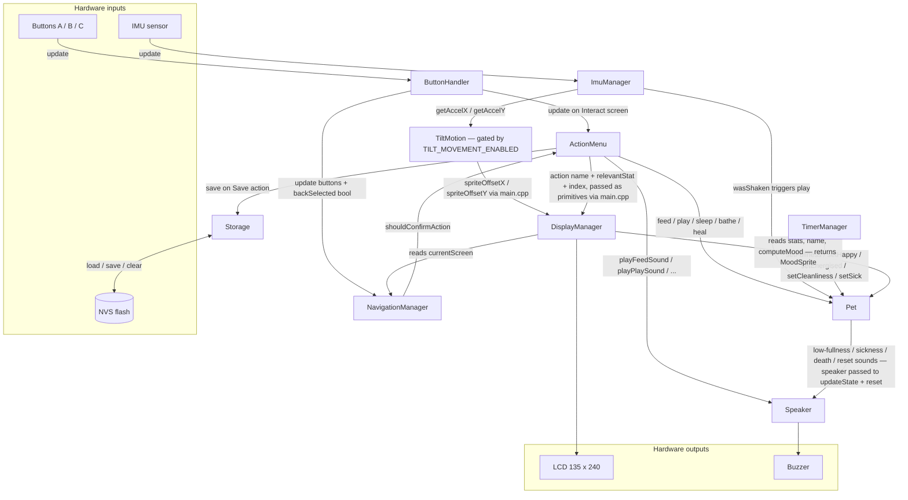
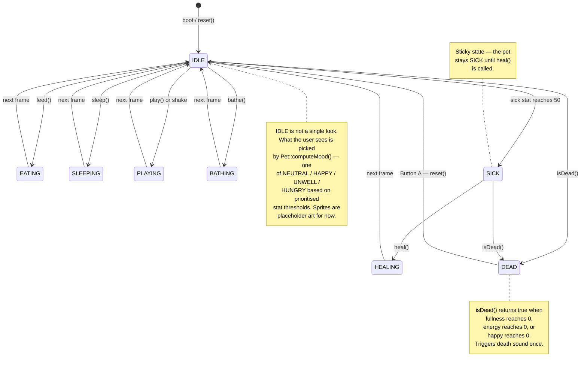

# Virtual Pet — Logical Flow

This document is the runtime picture of the project: what happens when the device powers on, what happens on every frame of the main loop, and which module talks to which. It complements `CLAUDE.md` (which has the per-module Architecture Map and the *why* behind each module's design) and `DEV_ROADMAP.md` (task-level history and next steps).

If you are reading the code for the first time, start here, then open `src/main.cpp` — every step below maps to a real line in that file.

---

## Boot — `setup()`

Runs once when the device powers on.

1. `M5.begin()` — wakes the M5StickC Plus 2 hardware (display, buttons, IMU, speaker).
2. `display.init()` — clears the LCD and prepares the off-screen drawing canvas.
3. `speaker.init()` — readies the built-in buzzer.
4. `storage.load(myPet)` — restores the pet's saved stats from NVS flash. On a fresh device with nothing saved, `load()` falls back to healthy defaults so the pet always boots alive.
5. `display.showMessage("Virtual Pet initialized!")` — a brief splash so the player knows the device is ready.

---

## Per-frame loop — `loop()`

Runs forever after `setup()` returns. `loop()` itself is a short orchestration that delegates to three named helpers, so each frame reads as a clear outline:

1. **Read hardware**
   - `M5.update()` — pull the latest button and IMU state from the chip.
   - `buttons.update()` — edge-detect which of A / B / C was pressed *this* frame.
   - `imu.update()` — read the accelerometer and update the shake detector.

2. **Run the state machine** — `myPet.updateState(speaker)` advances the pet's state, sets `STATE_DEAD` when fullness, energy, or happiness reaches 0, **and** plays the matching low-fullness / sickness / death sound when a stat crosses its alert threshold. The pet owns its own audio for these events — `main.cpp` never reads alert flags or calls the speaker for an alert.

3. **Branch on aliveness** — `myPet.isInDeadState()` picks one of two helpers:
   - **`handleDeathScreen()`** — runs only when the pet is dead. The only interaction is Button A → `myPet.reset(speaker)` (the pet plays its own restart fanfare) + `storage.clear()` so the dead pet doesn't reload on the next boot.
   - **`updateLivePet()`** — one frame of normal activity while the pet is alive:
     - `timers.update(myPet)` — background decay (fullness ticks down; happiness / energy / cleanliness tick down; sickness slowly accumulates). All timing rules live in `TimerManager`.
     - On the Interact screen only, `menu.update(buttons)` cycles the action list.
     - `navManager.update(buttons, menu.isBackSelected())` handles screen transitions. `main.cpp` extracts the Back-selected bool from the menu so `NavigationManager` doesn't need to know what an `ActionMenu` is.
     - `navManager.shouldConfirmAction()` is true for exactly one frame when the user presses A on a real action → `menu.confirmAction(myPet, display, speaker, storage)` mutates the pet, plays a sound, and (on the Save action) writes to storage. The user sees the result on the next render via the contextual stat bar; there is no separate feedback overlay.
     - `imu.wasShaken()` → `myPet.play()`: a shake gesture counts as play from any screen. `ImuManager` applies a cooldown so rapid shaking only fires `play()` once per gesture. Both the IMU/tilt reads and this shake→`play()` link are gated under `ENABLE_IMU_PLAY`.

4. **`renderCurrentScreen()`** — extracts the primitives `DisplayManager` needs (pet stats, dominant mood, name, dead-state flag, selected action's name + relevant stat + index, current screen) and calls `display.renderDisplay(...)` once. When the `TILT_MOVEMENT_ENABLED` flag is on, `main.cpp` also passes the current pet-sprite offset from `TiltMotion` into the render call so the sprite slides with device tilt; when off, the offset stays at `(0, 0)`. One render call per frame keeps the LCD flicker-free.

When the `DEBUG` flag is defined, the loop also calls `printPetStateToSerial()` — on its own throttled timer so it doesn't flood the monitor — to dump the pet's stats to the Serial monitor for debugging. It compiles out entirely when `DEBUG` is off.

---

## How the modules wire together

Reading the diagram top-to-bottom mirrors how a single frame flows: hardware input enters at the top, passes through the small input-handling modules (ButtonHandler, ImuManager), into the decision layer (NavigationManager, ActionMenu), reaches the data model (Pet, with background nudges from TimerManager) and persistence (Storage), and finally exits back out through Display and Speaker to the LCD and buzzer.

---

## Pet states — what the pet is doing right now

The pet always sits in exactly one `PetState` (defined in `lib/Pet/pet.h`). `Pet::updateState()` runs once per frame and decides whether to stay in the current state, return to idle, or jump to a new one. Every action method (`feed()`, `sleep()`, `play()`, `bathe()`, `heal()`) sets a state directly; the automatic transitions live inside `updateState()`.

A few things worth noticing about the diagram:

- **IDLE is the hub, but not a single look.** Most action states are transient: `EATING`, `SLEEPING`, `PLAYING`, `BATHING`, and `HEALING` last for exactly one frame, then `updateState()` snaps the pet back to `IDLE`. The stat changes already happened inside the action method, so by the time we land back in `IDLE` the mood may well have shifted — `feed()` might return the pet to an `IDLE` that now renders as "neutral" instead of "hungry". The mood the player sees is picked by `Pet::computeMood()`, a prioritised threshold ladder — `sick > 50 → UNWELL`, else `fullness < 30 → HUNGRY`, else `happy > 70 → HAPPY`, else `NEUTRAL` (first match wins). This is fully wired into the renderer: `computeMood()` returns a `MoodSprite`, which the whole display chain carries through to `spriteForMood()` so the face and the mood word can never disagree. (Known scope limit: the two *low* fatal stats — `happy → 0`, `energised → 0` — get no sprite warning and stay `NEUTRAL` until death; a future `MOOD_SAD` / `MOOD_TIRED` is the natural "add your own mood" student exercise.)
- **SICK is sticky.** Once the sick stat reaches 50, `IDLE` transitions to `SICK` automatically and stays there. Only `heal()` gets the pet out.
- **DEAD is terminal until reset.** `isDead()` is checked at the top of `updateState()` *before* the state switch, so death can happen from any living state — the diagram shows it from `IDLE` and `SICK` only to stay readable. The only way out is the player pressing Button A on the death screen, which calls `myPet.reset()` and starts a fresh life back in `IDLE`.

---

## Internal collaborators

`AnimationManager` is owned as a private member of `DisplayManager` (`petAnimation = AnimationManager(SPRITE_80X80_TEST_FRAME_COUNT)`). It runs non-blocking frame cycling via `millis()` at 200 ms / 5 fps and is reset on screen transitions. Because it lives inside `DisplayManager`, it doesn't appear in the module-edge diagram above — it's an internal collaborator, not a module-level peer.

`TiltMotion` (in `lib/Imu/`) is owned by `main.cpp` (`spriteMotion`). Each frame `main.cpp` calls `spriteMotion.update(imu.getAccelX(), imu.getAccelY())` and passes the resulting `(offsetX, offsetY)` into `display.renderDisplay(...)`, which threads it through to `drawPetSprite()`. The entire effect is gated behind the `TILT_MOVEMENT_ENABLED` flag in `main.cpp` — flip it off and the pet draws dead-centre exactly as before. Unlike `AnimationManager`, `TiltMotion` IS shown in the diagram because it sits on the module-edge path between IMU and Display.

---

## See also

- `CLAUDE.md` → **Architecture Map** — the *why* behind each module's design and the per-module responsibility table.
- `DEV_ROADMAP.md` — task-level history and the current work queue.
